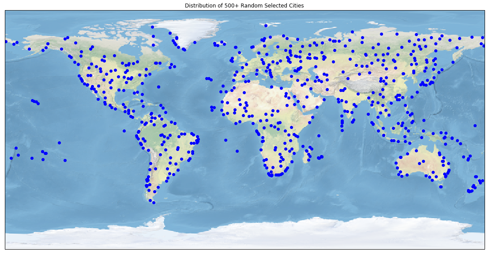
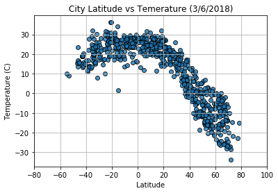
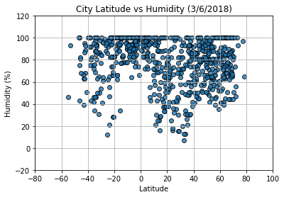
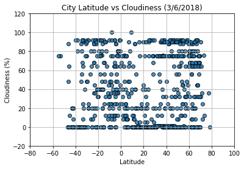
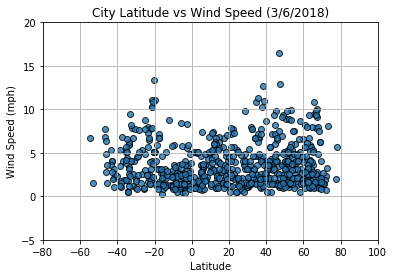

# Observed Trends

Trend 1: Temperature at equator is the highest. Overall the south part of the earth is warmer than north part now, that's because of the season difference.

Trend 2: Cloudiness is almost the same regardless of the latitude today.

Trend 3: higher wind speed can be found from the north part of the earth today.


```python
# Dependencies

from citipy import citipy
import random
import matplotlib.pyplot as plt
import requests
import json
import numpy as np
import pandas as pd
from mydata import *
from pprint import pprint
```


```python
# define a function to generate random lat/lon pairs
def random_lat_lon_generate(number):
    lat_list = [random.randint(-90, 91) for i in range(number)]
    lng_list = [random.randint(-180, 181) for i in range(number)]
    location_list = [(lat_list[i], lng_list[i]) for i in range(number)]
    return location_list
```


```python
# generate location list of 2,000 random lat/lon pairs
loc_list = random_lat_lon_generate(2000)
```


```python
# define a function to convert coordinates to city, country
def convert_coord_to_city(lat, lon):
    city = citipy.nearest_city(lat, lon)
    name = city.city_name
    code = city.country_code
    return name, code
```


```python
# convert 2,000 coordinates to city names & country codes
city_names = []
country_codes = []

for loc in loc_list:
    name, code = convert_coord_to_city(loc[0], loc[1])
    city_names.append(name)
    country_codes.append(code)
```


```python
# generate data frame using city names and country code, drop duplicate rows
df = pd.DataFrame({
    'City Name': city_names,
    'Country Code': country_codes
})

unique_df = df.drop_duplicates()
unique_df = unique_df.reset_index(drop=True)
```


```python
# set up additional columns to hold information
unique_df['Temperature'] = ""
unique_df['Humidity'] = ""
unique_df['Cloudiness'] = ""
unique_df['Wind Speed'] = ""
unique_df['Latitude'] = ""
unique_df['Longitude'] = ""

unique_df.head()
```


<div>
<style>
    .dataframe thead tr:only-child th {
        text-align: right;
    }

    .dataframe thead th {
        text-align: left;
    }

    .dataframe tbody tr th {
        vertical-align: top;
    }
</style>
<table border="1" class="dataframe">
  <thead>
    <tr style="text-align: right;">
      <th></th>
      <th>City Name</th>
      <th>Country Code</th>
      <th>Temperature</th>
      <th>Humidity</th>
      <th>Cloudiness</th>
      <th>Wind Speed</th>
      <th>Latitude</th>
      <th>Longitude</th>
    </tr>
  </thead>
  <tbody>
    <tr>
      <th>0</th>
      <td>port alfred</td>
      <td>za</td>
      <td></td>
      <td></td>
      <td></td>
      <td></td>
      <td></td>
      <td></td>
    </tr>
    <tr>
      <th>1</th>
      <td>kholmy</td>
      <td>ua</td>
      <td></td>
      <td></td>
      <td></td>
      <td></td>
      <td></td>
      <td></td>
    </tr>
    <tr>
      <th>2</th>
      <td>anjar</td>
      <td>in</td>
      <td></td>
      <td></td>
      <td></td>
      <td></td>
      <td></td>
      <td></td>
    </tr>
    <tr>
      <th>3</th>
      <td>mutsamudu</td>
      <td>km</td>
      <td></td>
      <td></td>
      <td></td>
      <td></td>
      <td></td>
      <td></td>
    </tr>
    <tr>
      <th>4</th>
      <td>busselton</td>
      <td>au</td>
      <td></td>
      <td></td>
      <td></td>
      <td></td>
      <td></td>
      <td></td>
    </tr>
  </tbody>
</table>
</div>


```python
# find the weather information for each city
base_url = f"https://api.openweathermap.org/data/2.5/weather?units=metric&appid={OpenWeather_api_key}"

# use iterrows to iterate through pandas dataframe
counter = 0
for index, row in unique_df.iterrows():
    
    # progress of the request
    print(f"Now handling city #{counter}: {row['City Name']}")
    counter += 1
    
    # assemble url and make API request
    query_url = f"{base_url}&q={row['City Name']},{row['Country Code']}"
    print(query_url)
    response = requests.get(query_url).json()
    
    # extract first result and use pd.set_value to insert into dataframe
    results = response.get('main')
    if (results):
        unique_df.set_value(index, 'Temperature', response['main']['temp'])
        unique_df.set_value(index, 'Humidity', response['main']['humidity'])
        unique_df.set_value(index, 'Cloudiness', response['clouds']['all'])
        unique_df.set_value(index, 'Wind Speed', response['wind']['speed'])
        unique_df.set_value(index, 'Latitude', response['coord']['lat'])
        unique_df.set_value(index, 'Longitude', response['coord']['lon'])
    else:
        print(f"No results for {row['City Name']}")
    print("------------------")
```

    Now handling city #0: port alfred
    https://api.openweathermap.org/data/2.5/weather?units=metric&appid=93c6b392174c7a538700dd943e4eb54d&q=port alfred,za
    ------------------
    Now handling city #1: kholmy
    https://api.openweathermap.org/data/2.5/weather?units=metric&appid=93c6b392174c7a538700dd943e4eb54d&q=kholmy,ua
    ------------------
    Now handling city #2: anjar
    https://api.openweathermap.org/data/2.5/weather?units=metric&appid=93c6b392174c7a538700dd943e4eb54d&q=anjar,in
    ------------------
    Now handling city #3: mutsamudu
    https://api.openweathermap.org/data/2.5/weather?units=metric&appid=93c6b392174c7a538700dd943e4eb54d&q=mutsamudu,km
    No results for mutsamudu
    ------------------
    Now handling city #4: busselton
    https://api.openweathermap.org/data/2.5/weather?units=metric&appid=93c6b392174c7a538700dd943e4eb54d&q=busselton,au
    ------------------
    Now handling city #5: albany
    https://api.openweathermap.org/data/2.5/weather?units=metric&appid=93c6b392174c7a538700dd943e4eb54d&q=albany,au
    ------------------
    Now handling city #6: taksimo
    https://api.openweathermap.org/data/2.5/weather?units=metric&appid=93c6b392174c7a538700dd943e4eb54d&q=taksimo,ru
    ------------------
    Now handling city #7: luderitz
    https://api.openweathermap.org/data/2.5/weather?units=metric&appid=93c6b392174c7a538700dd943e4eb54d&q=luderitz,na
    ------------------
    Now handling city #8: kieta
    https://api.openweathermap.org/data/2.5/weather?units=metric&appid=93c6b392174c7a538700dd943e4eb54d&q=kieta,pg
    ------------------
    Now handling city #9: atuona
    https://api.openweathermap.org/data/2.5/weather?units=metric&appid=93c6b392174c7a538700dd943e4eb54d&q=atuona,pf
    ------------------
    Now handling city #10: harrison
    https://api.openweathermap.org/data/2.5/weather?units=metric&appid=93c6b392174c7a538700dd943e4eb54d&q=harrison,us
    ------------------
    Now handling city #11: thompson
    https://api.openweathermap.org/data/2.5/weather?units=metric&appid=93c6b392174c7a538700dd943e4eb54d&q=thompson,ca
    ------------------
    Now handling city #12: barrow
    https://api.openweathermap.org/data/2.5/weather?units=metric&appid=93c6b392174c7a538700dd943e4eb54d&q=barrow,us
    ------------------
    Now handling city #13: ponta do sol
    https://api.openweathermap.org/data/2.5/weather?units=metric&appid=93c6b392174c7a538700dd943e4eb54d&q=ponta do sol,cv
    ------------------
    Now handling city #14: zhongshu
    https://api.openweathermap.org/data/2.5/weather?units=metric&appid=93c6b392174c7a538700dd943e4eb54d&q=zhongshu,cn
    ------------------
    Now handling city #15: youkounkoun
    https://api.openweathermap.org/data/2.5/weather?units=metric&appid=93c6b392174c7a538700dd943e4eb54d&q=youkounkoun,gn
    ------------------
    Now handling city #16: puerto ayora
    https://api.openweathermap.org/data/2.5/weather?units=metric&appid=93c6b392174c7a538700dd943e4eb54d&q=puerto ayora,ec
    ------------------
    Now handling city #17: kavaratti
    https://api.openweathermap.org/data/2.5/weather?units=metric&appid=93c6b392174c7a538700dd943e4eb54d&q=kavaratti,in
    ------------------
    Now handling city #18: punta arenas
    https://api.openweathermap.org/data/2.5/weather?units=metric&appid=93c6b392174c7a538700dd943e4eb54d&q=punta arenas,cl
    ------------------
    Now handling city #19: sentyabrskiy
    https://api.openweathermap.org/data/2.5/weather?units=metric&appid=93c6b392174c7a538700dd943e4eb54d&q=sentyabrskiy,ru
    No results for sentyabrskiy
    ------------------
    Now handling city #20: bengkulu
    https://api.openweathermap.org/data/2.5/weather?units=metric&appid=93c6b392174c7a538700dd943e4eb54d&q=bengkulu,id
    No results for bengkulu
    ------------------
    Now handling city #21: aksarka
    https://api.openweathermap.org/data/2.5/weather?units=metric&appid=93c6b392174c7a538700dd943e4eb54d&q=aksarka,ru
    ------------------
    Now handling city #22: hilo
    https://api.openweathermap.org/data/2.5/weather?units=metric&appid=93c6b392174c7a538700dd943e4eb54d&q=hilo,us
    ------------------
    Now handling city #23: jinsha
    https://api.openweathermap.org/data/2.5/weather?units=metric&appid=93c6b392174c7a538700dd943e4eb54d&q=jinsha,cn
    ------------------
    Now handling city #24: berezayka
    https://api.openweathermap.org/data/2.5/weather?units=metric&appid=93c6b392174c7a538700dd943e4eb54d&q=berezayka,ru
    ------------------
    Now handling city #25: butaritari
    https://api.openweathermap.org/data/2.5/weather?units=metric&appid=93c6b392174c7a538700dd943e4eb54d&q=butaritari,ki
    ------------------
    Now handling city #26: nanortalik
    https://api.openweathermap.org/data/2.5/weather?units=metric&appid=93c6b392174c7a538700dd943e4eb54d&q=nanortalik,gl
    ------------------
    Now handling city #27: arraial do cabo
    https://api.openweathermap.org/data/2.5/weather?units=metric&appid=93c6b392174c7a538700dd943e4eb54d&q=arraial do cabo,br
    ------------------
    Now handling city #28: upernavik
    https://api.openweathermap.org/data/2.5/weather?units=metric&appid=93c6b392174c7a538700dd943e4eb54d&q=upernavik,gl
    ------------------
    Now handling city #29: ushuaia
    https://api.openweathermap.org/data/2.5/weather?units=metric&appid=93c6b392174c7a538700dd943e4eb54d&q=ushuaia,ar
    ------------------
    Now handling city #30: nuevitas
    https://api.openweathermap.org/data/2.5/weather?units=metric&appid=93c6b392174c7a538700dd943e4eb54d&q=nuevitas,cu
    ------------------
    Now handling city #31: rikitea
    https://api.openweathermap.org/data/2.5/weather?units=metric&appid=93c6b392174c7a538700dd943e4eb54d&q=rikitea,pf
    ------------------
    Now handling city #32: custoias
    https://api.openweathermap.org/data/2.5/weather?units=metric&appid=93c6b392174c7a538700dd943e4eb54d&q=custoias,pt
    ------------------
    Now handling city #33: danshui
    https://api.openweathermap.org/data/2.5/weather?units=metric&appid=93c6b392174c7a538700dd943e4eb54d&q=danshui,cn
    ------------------
    Now handling city #34: kapaa
    https://api.openweathermap.org/data/2.5/weather?units=metric&appid=93c6b392174c7a538700dd943e4eb54d&q=kapaa,us
    ------------------
    Now handling city #35: guanare
    https://api.openweathermap.org/data/2.5/weather?units=metric&appid=93c6b392174c7a538700dd943e4eb54d&q=guanare,ve
    ------------------
    Now handling city #36: east london
    https://api.openweathermap.org/data/2.5/weather?units=metric&appid=93c6b392174c7a538700dd943e4eb54d&q=east london,za
    ------------------
    Now handling city #37: bambous virieux
    https://api.openweathermap.org/data/2.5/weather?units=metric&appid=93c6b392174c7a538700dd943e4eb54d&q=bambous virieux,mu
    ------------------
    Now handling city #38: airai
    https://api.openweathermap.org/data/2.5/weather?units=metric&appid=93c6b392174c7a538700dd943e4eb54d&q=airai,pw
    No results for airai
    ------------------
    Now handling city #39: tuktoyaktuk
    https://api.openweathermap.org/data/2.5/weather?units=metric&appid=93c6b392174c7a538700dd943e4eb54d&q=tuktoyaktuk,ca
    ------------------
    Now handling city #40: rungata
    https://api.openweathermap.org/data/2.5/weather?units=metric&appid=93c6b392174c7a538700dd943e4eb54d&q=rungata,ki
    No results for rungata
    ------------------
    Now handling city #41: port elizabeth
    https://api.openweathermap.org/data/2.5/weather?units=metric&appid=93c6b392174c7a538700dd943e4eb54d&q=port elizabeth,za
    ------------------
    Now handling city #42: chuy
    https://api.openweathermap.org/data/2.5/weather?units=metric&appid=93c6b392174c7a538700dd943e4eb54d&q=chuy,uy
    ------------------
    Now handling city #43: faanui
    https://api.openweathermap.org/data/2.5/weather?units=metric&appid=93c6b392174c7a538700dd943e4eb54d&q=faanui,pf
    ------------------
    Now handling city #44: esperance
    https://api.openweathermap.org/data/2.5/weather?units=metric&appid=93c6b392174c7a538700dd943e4eb54d&q=esperance,au
    ------------------
    Now handling city #45: qaanaaq
    https://api.openweathermap.org/data/2.5/weather?units=metric&appid=93c6b392174c7a538700dd943e4eb54d&q=qaanaaq,gl
    ------------------
    Now handling city #46: rawson
    https://api.openweathermap.org/data/2.5/weather?units=metric&appid=93c6b392174c7a538700dd943e4eb54d&q=rawson,ar
    ------------------
    Now handling city #47: yellowknife
    https://api.openweathermap.org/data/2.5/weather?units=metric&appid=93c6b392174c7a538700dd943e4eb54d&q=yellowknife,ca
    ------------------
    Now handling city #48: oktyabrskiy
    https://api.openweathermap.org/data/2.5/weather?units=metric&appid=93c6b392174c7a538700dd943e4eb54d&q=oktyabrskiy,ru
    ------------------
    Now handling city #49: kondinskoye
    https://api.openweathermap.org/data/2.5/weather?units=metric&appid=93c6b392174c7a538700dd943e4eb54d&q=kondinskoye,ru
    ------------------
    Now handling city #50: fort nelson
    https://api.openweathermap.org/data/2.5/weather?units=metric&appid=93c6b392174c7a538700dd943e4eb54d&q=fort nelson,ca
    ------------------
    Now handling city #51: hobyo
    https://api.openweathermap.org/data/2.5/weather?units=metric&appid=93c6b392174c7a538700dd943e4eb54d&q=hobyo,so
    ------------------
    Now handling city #52: hobart
    https://api.openweathermap.org/data/2.5/weather?units=metric&appid=93c6b392174c7a538700dd943e4eb54d&q=hobart,au
    ------------------
    Now handling city #53: taolanaro
    https://api.openweathermap.org/data/2.5/weather?units=metric&appid=93c6b392174c7a538700dd943e4eb54d&q=taolanaro,mg
    No results for taolanaro
    ------------------
    Now handling city #54: turukhansk
    https://api.openweathermap.org/data/2.5/weather?units=metric&appid=93c6b392174c7a538700dd943e4eb54d&q=turukhansk,ru
    ------------------
    Now handling city #55: baruun-urt
    https://api.openweathermap.org/data/2.5/weather?units=metric&appid=93c6b392174c7a538700dd943e4eb54d&q=baruun-urt,mn
    ------------------
    Now handling city #56: pampa
    https://api.openweathermap.org/data/2.5/weather?units=metric&appid=93c6b392174c7a538700dd943e4eb54d&q=pampa,us
    ------------------
    Now handling city #57: victoria
    https://api.openweathermap.org/data/2.5/weather?units=metric&appid=93c6b392174c7a538700dd943e4eb54d&q=victoria,sc
    ------------------
    Now handling city #58: ahipara
    https://api.openweathermap.org/data/2.5/weather?units=metric&appid=93c6b392174c7a538700dd943e4eb54d&q=ahipara,nz
    ------------------
    Now handling city #59: aracuai
    https://api.openweathermap.org/data/2.5/weather?units=metric&appid=93c6b392174c7a538700dd943e4eb54d&q=aracuai,br
    ------------------
    Now handling city #60: vaini
    https://api.openweathermap.org/data/2.5/weather?units=metric&appid=93c6b392174c7a538700dd943e4eb54d&q=vaini,to
    ------------------
    Now handling city #61: talnakh
    https://api.openweathermap.org/data/2.5/weather?units=metric&appid=93c6b392174c7a538700dd943e4eb54d&q=talnakh,ru
    ------------------
    Now handling city #62: hervey bay
    https://api.openweathermap.org/data/2.5/weather?units=metric&appid=93c6b392174c7a538700dd943e4eb54d&q=hervey bay,au
    ------------------
    Now handling city #63: sisimiut
    https://api.openweathermap.org/data/2.5/weather?units=metric&appid=93c6b392174c7a538700dd943e4eb54d&q=sisimiut,gl
    ------------------
    Now handling city #64: ostrovnoy
    https://api.openweathermap.org/data/2.5/weather?units=metric&appid=93c6b392174c7a538700dd943e4eb54d&q=ostrovnoy,ru
    ------------------
    Now handling city #65: mys shmidta
    https://api.openweathermap.org/data/2.5/weather?units=metric&appid=93c6b392174c7a538700dd943e4eb54d&q=mys shmidta,ru
    No results for mys shmidta
    ------------------
    Now handling city #66: mar del plata
    https://api.openweathermap.org/data/2.5/weather?units=metric&appid=93c6b392174c7a538700dd943e4eb54d&q=mar del plata,ar
    ------------------
    Now handling city #67: bredasdorp
    https://api.openweathermap.org/data/2.5/weather?units=metric&appid=93c6b392174c7a538700dd943e4eb54d&q=bredasdorp,za
    ------------------
    Now handling city #68: samarai
    https://api.openweathermap.org/data/2.5/weather?units=metric&appid=93c6b392174c7a538700dd943e4eb54d&q=samarai,pg
    ------------------
    Now handling city #69: chake chake
    https://api.openweathermap.org/data/2.5/weather?units=metric&appid=93c6b392174c7a538700dd943e4eb54d&q=chake chake,tz
    ------------------
    Now handling city #70: westport
    https://api.openweathermap.org/data/2.5/weather?units=metric&appid=93c6b392174c7a538700dd943e4eb54d&q=westport,nz
    ------------------
    Now handling city #71: kalaleh
    https://api.openweathermap.org/data/2.5/weather?units=metric&appid=93c6b392174c7a538700dd943e4eb54d&q=kalaleh,ir
    ------------------
    Now handling city #72: illoqqortoormiut
    https://api.openweathermap.org/data/2.5/weather?units=metric&appid=93c6b392174c7a538700dd943e4eb54d&q=illoqqortoormiut,gl
    No results for illoqqortoormiut
    ------------------
    Now handling city #73: klaksvik
    https://api.openweathermap.org/data/2.5/weather?units=metric&appid=93c6b392174c7a538700dd943e4eb54d&q=klaksvik,fo
    ------------------
    Now handling city #74: ribeira grande
    https://api.openweathermap.org/data/2.5/weather?units=metric&appid=93c6b392174c7a538700dd943e4eb54d&q=ribeira grande,pt
    ------------------
    Now handling city #75: kargasok
    https://api.openweathermap.org/data/2.5/weather?units=metric&appid=93c6b392174c7a538700dd943e4eb54d&q=kargasok,ru
    ------------------
    Now handling city #76: puerto cabezas
    https://api.openweathermap.org/data/2.5/weather?units=metric&appid=93c6b392174c7a538700dd943e4eb54d&q=puerto cabezas,ni
    ------------------
    Now handling city #77: gemena
    https://api.openweathermap.org/data/2.5/weather?units=metric&appid=93c6b392174c7a538700dd943e4eb54d&q=gemena,cd
    ------------------
    Now handling city #78: norman wells
    https://api.openweathermap.org/data/2.5/weather?units=metric&appid=93c6b392174c7a538700dd943e4eb54d&q=norman wells,ca
    ------------------
    Now handling city #79: ancud
    https://api.openweathermap.org/data/2.5/weather?units=metric&appid=93c6b392174c7a538700dd943e4eb54d&q=ancud,cl
    ------------------
    Now handling city #80: ko samui
    https://api.openweathermap.org/data/2.5/weather?units=metric&appid=93c6b392174c7a538700dd943e4eb54d&q=ko samui,th
    ------------------
    Now handling city #81: winnemucca
    https://api.openweathermap.org/data/2.5/weather?units=metric&appid=93c6b392174c7a538700dd943e4eb54d&q=winnemucca,us
    ------------------
    Now handling city #82: broken hill
    https://api.openweathermap.org/data/2.5/weather?units=metric&appid=93c6b392174c7a538700dd943e4eb54d&q=broken hill,au
    ------------------
    Now handling city #83: beringovskiy
    https://api.openweathermap.org/data/2.5/weather?units=metric&appid=93c6b392174c7a538700dd943e4eb54d&q=beringovskiy,ru
    ------------------
    Now handling city #84: san patricio
    https://api.openweathermap.org/data/2.5/weather?units=metric&appid=93c6b392174c7a538700dd943e4eb54d&q=san patricio,mx
    ------------------
    Now handling city #85: kattivakkam
    https://api.openweathermap.org/data/2.5/weather?units=metric&appid=93c6b392174c7a538700dd943e4eb54d&q=kattivakkam,in
    ------------------
    Now handling city #86: ostersund
    https://api.openweathermap.org/data/2.5/weather?units=metric&appid=93c6b392174c7a538700dd943e4eb54d&q=ostersund,se
    ------------------
    Now handling city #87: terny
    https://api.openweathermap.org/data/2.5/weather?units=metric&appid=93c6b392174c7a538700dd943e4eb54d&q=terny,ua
    ------------------
    Now handling city #88: batagay-alyta
    https://api.openweathermap.org/data/2.5/weather?units=metric&appid=93c6b392174c7a538700dd943e4eb54d&q=batagay-alyta,ru
    ------------------
    Now handling city #89: one hundred mile house
    https://api.openweathermap.org/data/2.5/weather?units=metric&appid=93c6b392174c7a538700dd943e4eb54d&q=one hundred mile house,ca
    No results for one hundred mile house
    ------------------
    Now handling city #90: vestmannaeyjar
    https://api.openweathermap.org/data/2.5/weather?units=metric&appid=93c6b392174c7a538700dd943e4eb54d&q=vestmannaeyjar,is
    ------------------
    Now handling city #91: narsaq
    https://api.openweathermap.org/data/2.5/weather?units=metric&appid=93c6b392174c7a538700dd943e4eb54d&q=narsaq,gl
    ------------------
    Now handling city #92: mahebourg
    https://api.openweathermap.org/data/2.5/weather?units=metric&appid=93c6b392174c7a538700dd943e4eb54d&q=mahebourg,mu
    ------------------
    Now handling city #93: vila franca do campo
    https://api.openweathermap.org/data/2.5/weather?units=metric&appid=93c6b392174c7a538700dd943e4eb54d&q=vila franca do campo,pt
    ------------------
    Now handling city #94: avarua
    https://api.openweathermap.org/data/2.5/weather?units=metric&appid=93c6b392174c7a538700dd943e4eb54d&q=avarua,ck
    ------------------
    Now handling city #95: limbang
    https://api.openweathermap.org/data/2.5/weather?units=metric&appid=93c6b392174c7a538700dd943e4eb54d&q=limbang,my
    ------------------
    Now handling city #96: sao filipe
    https://api.openweathermap.org/data/2.5/weather?units=metric&appid=93c6b392174c7a538700dd943e4eb54d&q=sao filipe,cv
    ------------------
    Now handling city #97: lavrentiya
    https://api.openweathermap.org/data/2.5/weather?units=metric&appid=93c6b392174c7a538700dd943e4eb54d&q=lavrentiya,ru
    ------------------
    Now handling city #98: khatanga
    https://api.openweathermap.org/data/2.5/weather?units=metric&appid=93c6b392174c7a538700dd943e4eb54d&q=khatanga,ru
    ------------------
    Now handling city #99: cape town
    https://api.openweathermap.org/data/2.5/weather?units=metric&appid=93c6b392174c7a538700dd943e4eb54d&q=cape town,za
    ------------------
    Now handling city #100: samusu
    https://api.openweathermap.org/data/2.5/weather?units=metric&appid=93c6b392174c7a538700dd943e4eb54d&q=samusu,ws
    No results for samusu
    ------------------
    Now handling city #101: roura
    https://api.openweathermap.org/data/2.5/weather?units=metric&appid=93c6b392174c7a538700dd943e4eb54d&q=roura,gf
    ------------------
    Now handling city #102: georgetown
    https://api.openweathermap.org/data/2.5/weather?units=metric&appid=93c6b392174c7a538700dd943e4eb54d&q=georgetown,sh
    ------------------
    Now handling city #103: jamestown
    https://api.openweathermap.org/data/2.5/weather?units=metric&appid=93c6b392174c7a538700dd943e4eb54d&q=jamestown,sh
    ------------------
    Now handling city #104: priyutovo
    https://api.openweathermap.org/data/2.5/weather?units=metric&appid=93c6b392174c7a538700dd943e4eb54d&q=priyutovo,ru
    ------------------
    Now handling city #105: manokwari
    https://api.openweathermap.org/data/2.5/weather?units=metric&appid=93c6b392174c7a538700dd943e4eb54d&q=manokwari,id
    ------------------
    Now handling city #106: haines junction
    https://api.openweathermap.org/data/2.5/weather?units=metric&appid=93c6b392174c7a538700dd943e4eb54d&q=haines junction,ca
    ------------------
    Now handling city #107: abapo
    https://api.openweathermap.org/data/2.5/weather?units=metric&appid=93c6b392174c7a538700dd943e4eb54d&q=abapo,bo
    ------------------
    Now handling city #108: tiksi
    https://api.openweathermap.org/data/2.5/weather?units=metric&appid=93c6b392174c7a538700dd943e4eb54d&q=tiksi,ru
    ------------------
    Now handling city #109: belaya gora
    https://api.openweathermap.org/data/2.5/weather?units=metric&appid=93c6b392174c7a538700dd943e4eb54d&q=belaya gora,ru
    ------------------
    Now handling city #110: ulladulla
    https://api.openweathermap.org/data/2.5/weather?units=metric&appid=93c6b392174c7a538700dd943e4eb54d&q=ulladulla,au
    ------------------
    Now handling city #111: helong
    https://api.openweathermap.org/data/2.5/weather?units=metric&appid=93c6b392174c7a538700dd943e4eb54d&q=helong,cn
    ------------------
    Now handling city #112: madison
    https://api.openweathermap.org/data/2.5/weather?units=metric&appid=93c6b392174c7a538700dd943e4eb54d&q=madison,us
    ------------------
    Now handling city #113: ketchikan
    https://api.openweathermap.org/data/2.5/weather?units=metric&appid=93c6b392174c7a538700dd943e4eb54d&q=ketchikan,us
    ------------------
    Now handling city #114: tuatapere
    https://api.openweathermap.org/data/2.5/weather?units=metric&appid=93c6b392174c7a538700dd943e4eb54d&q=tuatapere,nz
    ------------------
    Now handling city #115: halalo
    https://api.openweathermap.org/data/2.5/weather?units=metric&appid=93c6b392174c7a538700dd943e4eb54d&q=halalo,wf
    No results for halalo
    ------------------
    Now handling city #116: santa maria
    https://api.openweathermap.org/data/2.5/weather?units=metric&appid=93c6b392174c7a538700dd943e4eb54d&q=santa maria,cv
    ------------------
    Now handling city #117: bluff
    https://api.openweathermap.org/data/2.5/weather?units=metric&appid=93c6b392174c7a538700dd943e4eb54d&q=bluff,nz
    ------------------
    Now handling city #118: mahanoro
    https://api.openweathermap.org/data/2.5/weather?units=metric&appid=93c6b392174c7a538700dd943e4eb54d&q=mahanoro,mg
    ------------------
    Now handling city #119: burica
    https://api.openweathermap.org/data/2.5/weather?units=metric&appid=93c6b392174c7a538700dd943e4eb54d&q=burica,pa
    No results for burica
    ------------------
    Now handling city #120: iqaluit
    https://api.openweathermap.org/data/2.5/weather?units=metric&appid=93c6b392174c7a538700dd943e4eb54d&q=iqaluit,ca
    ------------------
    Now handling city #121: chardara
    https://api.openweathermap.org/data/2.5/weather?units=metric&appid=93c6b392174c7a538700dd943e4eb54d&q=chardara,kz
    No results for chardara
    ------------------
    Now handling city #122: watrous
    https://api.openweathermap.org/data/2.5/weather?units=metric&appid=93c6b392174c7a538700dd943e4eb54d&q=watrous,ca
    ------------------
    Now handling city #123: hacienda heights
    https://api.openweathermap.org/data/2.5/weather?units=metric&appid=93c6b392174c7a538700dd943e4eb54d&q=hacienda heights,us
    ------------------
    Now handling city #124: hualmay
    https://api.openweathermap.org/data/2.5/weather?units=metric&appid=93c6b392174c7a538700dd943e4eb54d&q=hualmay,pe
    ------------------
    Now handling city #125: banda aceh
    https://api.openweathermap.org/data/2.5/weather?units=metric&appid=93c6b392174c7a538700dd943e4eb54d&q=banda aceh,id
    ------------------
    Now handling city #126: alofi
    https://api.openweathermap.org/data/2.5/weather?units=metric&appid=93c6b392174c7a538700dd943e4eb54d&q=alofi,nu
    ------------------
    Now handling city #127: dolores
    https://api.openweathermap.org/data/2.5/weather?units=metric&appid=93c6b392174c7a538700dd943e4eb54d&q=dolores,ar
    ------------------
    Now handling city #128: lagoa
    https://api.openweathermap.org/data/2.5/weather?units=metric&appid=93c6b392174c7a538700dd943e4eb54d&q=lagoa,pt
    ------------------
    Now handling city #129: kurilsk
    https://api.openweathermap.org/data/2.5/weather?units=metric&appid=93c6b392174c7a538700dd943e4eb54d&q=kurilsk,ru
    ------------------
    Now handling city #130: calvinia
    https://api.openweathermap.org/data/2.5/weather?units=metric&appid=93c6b392174c7a538700dd943e4eb54d&q=calvinia,za
    ------------------
    Now handling city #131: havre-saint-pierre
    https://api.openweathermap.org/data/2.5/weather?units=metric&appid=93c6b392174c7a538700dd943e4eb54d&q=havre-saint-pierre,ca
    ------------------
    Now handling city #132: port blair
    https://api.openweathermap.org/data/2.5/weather?units=metric&appid=93c6b392174c7a538700dd943e4eb54d&q=port blair,in
    ------------------
    Now handling city #133: nizhneyansk
    https://api.openweathermap.org/data/2.5/weather?units=metric&appid=93c6b392174c7a538700dd943e4eb54d&q=nizhneyansk,ru
    No results for nizhneyansk
    ------------------
    Now handling city #134: hikari
    https://api.openweathermap.org/data/2.5/weather?units=metric&appid=93c6b392174c7a538700dd943e4eb54d&q=hikari,jp
    ------------------
    Now handling city #135: abu samrah
    https://api.openweathermap.org/data/2.5/weather?units=metric&appid=93c6b392174c7a538700dd943e4eb54d&q=abu samrah,qa
    No results for abu samrah
    ------------------
    Now handling city #136: puerto escondido
    https://api.openweathermap.org/data/2.5/weather?units=metric&appid=93c6b392174c7a538700dd943e4eb54d&q=puerto escondido,mx
    ------------------
    Now handling city #137: grand river south east
    https://api.openweathermap.org/data/2.5/weather?units=metric&appid=93c6b392174c7a538700dd943e4eb54d&q=grand river south east,mu
    No results for grand river south east
    ------------------
    Now handling city #138: rancho palos verdes
    https://api.openweathermap.org/data/2.5/weather?units=metric&appid=93c6b392174c7a538700dd943e4eb54d&q=rancho palos verdes,us
    ------------------
    Now handling city #139: san felipe
    https://api.openweathermap.org/data/2.5/weather?units=metric&appid=93c6b392174c7a538700dd943e4eb54d&q=san felipe,mx
    ------------------
    Now handling city #140: bulgan
    https://api.openweathermap.org/data/2.5/weather?units=metric&appid=93c6b392174c7a538700dd943e4eb54d&q=bulgan,mn
    ------------------
    Now handling city #141: zemio
    https://api.openweathermap.org/data/2.5/weather?units=metric&appid=93c6b392174c7a538700dd943e4eb54d&q=zemio,cf
    ------------------
    Now handling city #142: sioux lookout
    https://api.openweathermap.org/data/2.5/weather?units=metric&appid=93c6b392174c7a538700dd943e4eb54d&q=sioux lookout,ca
    ------------------
    Now handling city #143: saint-philippe
    https://api.openweathermap.org/data/2.5/weather?units=metric&appid=93c6b392174c7a538700dd943e4eb54d&q=saint-philippe,re
    ------------------
    Now handling city #144: balkanabat
    https://api.openweathermap.org/data/2.5/weather?units=metric&appid=93c6b392174c7a538700dd943e4eb54d&q=balkanabat,tm
    ------------------
    Now handling city #145: mataura
    https://api.openweathermap.org/data/2.5/weather?units=metric&appid=93c6b392174c7a538700dd943e4eb54d&q=mataura,pf
    No results for mataura
    ------------------
    Now handling city #146: aklavik
    https://api.openweathermap.org/data/2.5/weather?units=metric&appid=93c6b392174c7a538700dd943e4eb54d&q=aklavik,ca
    ------------------
    Now handling city #147: sitka
    https://api.openweathermap.org/data/2.5/weather?units=metric&appid=93c6b392174c7a538700dd943e4eb54d&q=sitka,us
    ------------------
    Now handling city #148: el terrero
    https://api.openweathermap.org/data/2.5/weather?units=metric&appid=93c6b392174c7a538700dd943e4eb54d&q=el terrero,hn
    ------------------
    Now handling city #149: torbay
    https://api.openweathermap.org/data/2.5/weather?units=metric&appid=93c6b392174c7a538700dd943e4eb54d&q=torbay,ca
    ------------------
    Now handling city #150: voghera
    https://api.openweathermap.org/data/2.5/weather?units=metric&appid=93c6b392174c7a538700dd943e4eb54d&q=voghera,it
    ------------------
    Now handling city #151: deh rawud
    https://api.openweathermap.org/data/2.5/weather?units=metric&appid=93c6b392174c7a538700dd943e4eb54d&q=deh rawud,af
    No results for deh rawud
    ------------------
    Now handling city #152: blackwater
    https://api.openweathermap.org/data/2.5/weather?units=metric&appid=93c6b392174c7a538700dd943e4eb54d&q=blackwater,au
    ------------------
    Now handling city #153: asau
    https://api.openweathermap.org/data/2.5/weather?units=metric&appid=93c6b392174c7a538700dd943e4eb54d&q=asau,tv
    No results for asau
    ------------------
    Now handling city #154: alice springs
    https://api.openweathermap.org/data/2.5/weather?units=metric&appid=93c6b392174c7a538700dd943e4eb54d&q=alice springs,au
    ------------------
    Now handling city #155: acajutla
    https://api.openweathermap.org/data/2.5/weather?units=metric&appid=93c6b392174c7a538700dd943e4eb54d&q=acajutla,sv
    ------------------
    Now handling city #156: biltine
    https://api.openweathermap.org/data/2.5/weather?units=metric&appid=93c6b392174c7a538700dd943e4eb54d&q=biltine,td
    ------------------
    Now handling city #157: acapulco
    https://api.openweathermap.org/data/2.5/weather?units=metric&appid=93c6b392174c7a538700dd943e4eb54d&q=acapulco,mx
    ------------------
    Now handling city #158: novoleushkovskaya
    https://api.openweathermap.org/data/2.5/weather?units=metric&appid=93c6b392174c7a538700dd943e4eb54d&q=novoleushkovskaya,ru
    ------------------
    Now handling city #159: luanda
    https://api.openweathermap.org/data/2.5/weather?units=metric&appid=93c6b392174c7a538700dd943e4eb54d&q=luanda,ao
    ------------------
    Now handling city #160: bethel
    https://api.openweathermap.org/data/2.5/weather?units=metric&appid=93c6b392174c7a538700dd943e4eb54d&q=bethel,us
    ------------------
    Now handling city #161: hay river
    https://api.openweathermap.org/data/2.5/weather?units=metric&appid=93c6b392174c7a538700dd943e4eb54d&q=hay river,ca
    ------------------
    Now handling city #162: saint george
    https://api.openweathermap.org/data/2.5/weather?units=metric&appid=93c6b392174c7a538700dd943e4eb54d&q=saint george,bm
    ------------------
    Now handling city #163: korla
    https://api.openweathermap.org/data/2.5/weather?units=metric&appid=93c6b392174c7a538700dd943e4eb54d&q=korla,cn
    ------------------
    Now handling city #164: niksic
    https://api.openweathermap.org/data/2.5/weather?units=metric&appid=93c6b392174c7a538700dd943e4eb54d&q=niksic,me
    ------------------
    Now handling city #165: bargal
    https://api.openweathermap.org/data/2.5/weather?units=metric&appid=93c6b392174c7a538700dd943e4eb54d&q=bargal,so
    No results for bargal
    ------------------
    Now handling city #166: new norfolk
    https://api.openweathermap.org/data/2.5/weather?units=metric&appid=93c6b392174c7a538700dd943e4eb54d&q=new norfolk,au
    ------------------
    Now handling city #167: caravelas
    https://api.openweathermap.org/data/2.5/weather?units=metric&appid=93c6b392174c7a538700dd943e4eb54d&q=caravelas,br
    ------------------
    Now handling city #168: tura
    https://api.openweathermap.org/data/2.5/weather?units=metric&appid=93c6b392174c7a538700dd943e4eb54d&q=tura,ru
    ------------------
    Now handling city #169: lysva
    https://api.openweathermap.org/data/2.5/weather?units=metric&appid=93c6b392174c7a538700dd943e4eb54d&q=lysva,ru
    ------------------
    Now handling city #170: faya
    https://api.openweathermap.org/data/2.5/weather?units=metric&appid=93c6b392174c7a538700dd943e4eb54d&q=faya,td
    No results for faya
    ------------------
    Now handling city #171: codrington
    https://api.openweathermap.org/data/2.5/weather?units=metric&appid=93c6b392174c7a538700dd943e4eb54d&q=codrington,ag
    No results for codrington
    ------------------
    Now handling city #172: kutum
    https://api.openweathermap.org/data/2.5/weather?units=metric&appid=93c6b392174c7a538700dd943e4eb54d&q=kutum,sd
    ------------------
    Now handling city #173: port-gentil
    https://api.openweathermap.org/data/2.5/weather?units=metric&appid=93c6b392174c7a538700dd943e4eb54d&q=port-gentil,ga
    ------------------
    Now handling city #174: hermanus
    https://api.openweathermap.org/data/2.5/weather?units=metric&appid=93c6b392174c7a538700dd943e4eb54d&q=hermanus,za
    ------------------
    Now handling city #175: leningradskiy
    https://api.openweathermap.org/data/2.5/weather?units=metric&appid=93c6b392174c7a538700dd943e4eb54d&q=leningradskiy,ru
    ------------------
    Now handling city #176: campoverde
    https://api.openweathermap.org/data/2.5/weather?units=metric&appid=93c6b392174c7a538700dd943e4eb54d&q=campoverde,pe
    ------------------
    Now handling city #177: mahajanga
    https://api.openweathermap.org/data/2.5/weather?units=metric&appid=93c6b392174c7a538700dd943e4eb54d&q=mahajanga,mg
    ------------------
    Now handling city #178: gat
    https://api.openweathermap.org/data/2.5/weather?units=metric&appid=93c6b392174c7a538700dd943e4eb54d&q=gat,ly
    No results for gat
    ------------------
    Now handling city #179: ulety
    https://api.openweathermap.org/data/2.5/weather?units=metric&appid=93c6b392174c7a538700dd943e4eb54d&q=ulety,ru
    ------------------
    Now handling city #180: elko
    https://api.openweathermap.org/data/2.5/weather?units=metric&appid=93c6b392174c7a538700dd943e4eb54d&q=elko,us
    ------------------
    Now handling city #181: altay
    https://api.openweathermap.org/data/2.5/weather?units=metric&appid=93c6b392174c7a538700dd943e4eb54d&q=altay,cn
    ------------------
    Now handling city #182: medvezhyegorsk
    https://api.openweathermap.org/data/2.5/weather?units=metric&appid=93c6b392174c7a538700dd943e4eb54d&q=medvezhyegorsk,ru
    ------------------
    Now handling city #183: mae sai
    https://api.openweathermap.org/data/2.5/weather?units=metric&appid=93c6b392174c7a538700dd943e4eb54d&q=mae sai,th
    ------------------
    Now handling city #184: castro
    https://api.openweathermap.org/data/2.5/weather?units=metric&appid=93c6b392174c7a538700dd943e4eb54d&q=castro,cl
    ------------------
    Now handling city #185: taoudenni
    https://api.openweathermap.org/data/2.5/weather?units=metric&appid=93c6b392174c7a538700dd943e4eb54d&q=taoudenni,ml
    ------------------
    Now handling city #186: sinkat
    https://api.openweathermap.org/data/2.5/weather?units=metric&appid=93c6b392174c7a538700dd943e4eb54d&q=sinkat,sd
    No results for sinkat
    ------------------
    Now handling city #187: maniitsoq
    https://api.openweathermap.org/data/2.5/weather?units=metric&appid=93c6b392174c7a538700dd943e4eb54d&q=maniitsoq,gl
    ------------------
    Now handling city #188: vao
    https://api.openweathermap.org/data/2.5/weather?units=metric&appid=93c6b392174c7a538700dd943e4eb54d&q=vao,nc
    ------------------
    Now handling city #189: boa vista
    https://api.openweathermap.org/data/2.5/weather?units=metric&appid=93c6b392174c7a538700dd943e4eb54d&q=boa vista,br
    ------------------
    Now handling city #190: aviles
    https://api.openweathermap.org/data/2.5/weather?units=metric&appid=93c6b392174c7a538700dd943e4eb54d&q=aviles,es
    ------------------
    Now handling city #191: murgab
    https://api.openweathermap.org/data/2.5/weather?units=metric&appid=93c6b392174c7a538700dd943e4eb54d&q=murgab,tm
    ------------------
    Now handling city #192: meulaboh
    https://api.openweathermap.org/data/2.5/weather?units=metric&appid=93c6b392174c7a538700dd943e4eb54d&q=meulaboh,id
    ------------------
    Now handling city #193: christchurch
    https://api.openweathermap.org/data/2.5/weather?units=metric&appid=93c6b392174c7a538700dd943e4eb54d&q=christchurch,nz
    ------------------
    Now handling city #194: nikolskoye
    https://api.openweathermap.org/data/2.5/weather?units=metric&appid=93c6b392174c7a538700dd943e4eb54d&q=nikolskoye,ru
    ------------------
    Now handling city #195: dikson
    https://api.openweathermap.org/data/2.5/weather?units=metric&appid=93c6b392174c7a538700dd943e4eb54d&q=dikson,ru
    ------------------
    Now handling city #196: tasiilaq
    https://api.openweathermap.org/data/2.5/weather?units=metric&appid=93c6b392174c7a538700dd943e4eb54d&q=tasiilaq,gl
    ------------------
    Now handling city #197: plettenberg bay
    https://api.openweathermap.org/data/2.5/weather?units=metric&appid=93c6b392174c7a538700dd943e4eb54d&q=plettenberg bay,za
    ------------------
    Now handling city #198: fortuna
    https://api.openweathermap.org/data/2.5/weather?units=metric&appid=93c6b392174c7a538700dd943e4eb54d&q=fortuna,us
    ------------------
    Now handling city #199: kupang
    https://api.openweathermap.org/data/2.5/weather?units=metric&appid=93c6b392174c7a538700dd943e4eb54d&q=kupang,id
    ------------------
    Now handling city #200: nemuro
    https://api.openweathermap.org/data/2.5/weather?units=metric&appid=93c6b392174c7a538700dd943e4eb54d&q=nemuro,jp
    ------------------
    Now handling city #201: ajaccio
    https://api.openweathermap.org/data/2.5/weather?units=metric&appid=93c6b392174c7a538700dd943e4eb54d&q=ajaccio,fr
    ------------------
    Now handling city #202: mitsukaido
    https://api.openweathermap.org/data/2.5/weather?units=metric&appid=93c6b392174c7a538700dd943e4eb54d&q=mitsukaido,jp
    ------------------
    Now handling city #203: xining
    https://api.openweathermap.org/data/2.5/weather?units=metric&appid=93c6b392174c7a538700dd943e4eb54d&q=xining,cn
    ------------------
    Now handling city #204: the valley
    https://api.openweathermap.org/data/2.5/weather?units=metric&appid=93c6b392174c7a538700dd943e4eb54d&q=the valley,ai
    ------------------
    Now handling city #205: dunedin
    https://api.openweathermap.org/data/2.5/weather?units=metric&appid=93c6b392174c7a538700dd943e4eb54d&q=dunedin,nz
    ------------------
    Now handling city #206: kaitangata
    https://api.openweathermap.org/data/2.5/weather?units=metric&appid=93c6b392174c7a538700dd943e4eb54d&q=kaitangata,nz
    ------------------
    Now handling city #207: carnarvon
    https://api.openweathermap.org/data/2.5/weather?units=metric&appid=93c6b392174c7a538700dd943e4eb54d&q=carnarvon,au
    ------------------
    Now handling city #208: waipawa
    https://api.openweathermap.org/data/2.5/weather?units=metric&appid=93c6b392174c7a538700dd943e4eb54d&q=waipawa,nz
    ------------------
    Now handling city #209: nuqui
    https://api.openweathermap.org/data/2.5/weather?units=metric&appid=93c6b392174c7a538700dd943e4eb54d&q=nuqui,co
    ------------------
    Now handling city #210: itupiranga
    https://api.openweathermap.org/data/2.5/weather?units=metric&appid=93c6b392174c7a538700dd943e4eb54d&q=itupiranga,br
    ------------------
    Now handling city #211: lazaro cardenas
    https://api.openweathermap.org/data/2.5/weather?units=metric&appid=93c6b392174c7a538700dd943e4eb54d&q=lazaro cardenas,mx
    ------------------
    Now handling city #212: tommot
    https://api.openweathermap.org/data/2.5/weather?units=metric&appid=93c6b392174c7a538700dd943e4eb54d&q=tommot,ru
    ------------------
    Now handling city #213: saskylakh
    https://api.openweathermap.org/data/2.5/weather?units=metric&appid=93c6b392174c7a538700dd943e4eb54d&q=saskylakh,ru
    ------------------
    Now handling city #214: vaitupu
    https://api.openweathermap.org/data/2.5/weather?units=metric&appid=93c6b392174c7a538700dd943e4eb54d&q=vaitupu,wf
    No results for vaitupu
    ------------------
    Now handling city #215: attawapiskat
    https://api.openweathermap.org/data/2.5/weather?units=metric&appid=93c6b392174c7a538700dd943e4eb54d&q=attawapiskat,ca
    No results for attawapiskat
    ------------------
    Now handling city #216: worland
    https://api.openweathermap.org/data/2.5/weather?units=metric&appid=93c6b392174c7a538700dd943e4eb54d&q=worland,us
    ------------------
    Now handling city #217: markova
    https://api.openweathermap.org/data/2.5/weather?units=metric&appid=93c6b392174c7a538700dd943e4eb54d&q=markova,ru
    ------------------
    Now handling city #218: hofn
    https://api.openweathermap.org/data/2.5/weather?units=metric&appid=93c6b392174c7a538700dd943e4eb54d&q=hofn,is
    ------------------
    Now handling city #219: makhu
    https://api.openweathermap.org/data/2.5/weather?units=metric&appid=93c6b392174c7a538700dd943e4eb54d&q=makhu,in
    ------------------
    Now handling city #220: sorland
    https://api.openweathermap.org/data/2.5/weather?units=metric&appid=93c6b392174c7a538700dd943e4eb54d&q=sorland,no
    ------------------
    Now handling city #221: veshkayma
    https://api.openweathermap.org/data/2.5/weather?units=metric&appid=93c6b392174c7a538700dd943e4eb54d&q=veshkayma,ru
    ------------------
    Now handling city #222: belushya guba
    https://api.openweathermap.org/data/2.5/weather?units=metric&appid=93c6b392174c7a538700dd943e4eb54d&q=belushya guba,ru
    No results for belushya guba
    ------------------
    Now handling city #223: kavieng
    https://api.openweathermap.org/data/2.5/weather?units=metric&appid=93c6b392174c7a538700dd943e4eb54d&q=kavieng,pg
    ------------------
    Now handling city #224: tete
    https://api.openweathermap.org/data/2.5/weather?units=metric&appid=93c6b392174c7a538700dd943e4eb54d&q=tete,mz
    ------------------
    Now handling city #225: nioaque
    https://api.openweathermap.org/data/2.5/weather?units=metric&appid=93c6b392174c7a538700dd943e4eb54d&q=nioaque,br
    ------------------
    Now handling city #226: buala
    https://api.openweathermap.org/data/2.5/weather?units=metric&appid=93c6b392174c7a538700dd943e4eb54d&q=buala,sb
    ------------------
    Now handling city #227: gao
    https://api.openweathermap.org/data/2.5/weather?units=metric&appid=93c6b392174c7a538700dd943e4eb54d&q=gao,ml
    ------------------
    Now handling city #228: mandalgovi
    https://api.openweathermap.org/data/2.5/weather?units=metric&appid=93c6b392174c7a538700dd943e4eb54d&q=mandalgovi,mn
    ------------------
    Now handling city #229: solnechnyy
    https://api.openweathermap.org/data/2.5/weather?units=metric&appid=93c6b392174c7a538700dd943e4eb54d&q=solnechnyy,ru
    ------------------
    Now handling city #230: bamora
    https://api.openweathermap.org/data/2.5/weather?units=metric&appid=93c6b392174c7a538700dd943e4eb54d&q=bamora,in
    No results for bamora
    ------------------
    Now handling city #231: amudat
    https://api.openweathermap.org/data/2.5/weather?units=metric&appid=93c6b392174c7a538700dd943e4eb54d&q=amudat,ug
    ------------------
    Now handling city #232: itarema
    https://api.openweathermap.org/data/2.5/weather?units=metric&appid=93c6b392174c7a538700dd943e4eb54d&q=itarema,br
    ------------------
    Now handling city #233: mlalo
    https://api.openweathermap.org/data/2.5/weather?units=metric&appid=93c6b392174c7a538700dd943e4eb54d&q=mlalo,tz
    ------------------
    Now handling city #234: hasaki
    https://api.openweathermap.org/data/2.5/weather?units=metric&appid=93c6b392174c7a538700dd943e4eb54d&q=hasaki,jp
    ------------------
    Now handling city #235: itaituba
    https://api.openweathermap.org/data/2.5/weather?units=metric&appid=93c6b392174c7a538700dd943e4eb54d&q=itaituba,br
    ------------------
    Now handling city #236: kontagora
    https://api.openweathermap.org/data/2.5/weather?units=metric&appid=93c6b392174c7a538700dd943e4eb54d&q=kontagora,ng
    ------------------
    Now handling city #237: svetlogorsk
    https://api.openweathermap.org/data/2.5/weather?units=metric&appid=93c6b392174c7a538700dd943e4eb54d&q=svetlogorsk,ru
    ------------------
    Now handling city #238: barranca
    https://api.openweathermap.org/data/2.5/weather?units=metric&appid=93c6b392174c7a538700dd943e4eb54d&q=barranca,pe
    ------------------
    Now handling city #239: sosnogorsk
    https://api.openweathermap.org/data/2.5/weather?units=metric&appid=93c6b392174c7a538700dd943e4eb54d&q=sosnogorsk,ru
    ------------------
    Now handling city #240: anadyr
    https://api.openweathermap.org/data/2.5/weather?units=metric&appid=93c6b392174c7a538700dd943e4eb54d&q=anadyr,ru
    ------------------
    Now handling city #241: lebu
    https://api.openweathermap.org/data/2.5/weather?units=metric&appid=93c6b392174c7a538700dd943e4eb54d&q=lebu,cl
    ------------------
    Now handling city #242: tsihombe
    https://api.openweathermap.org/data/2.5/weather?units=metric&appid=93c6b392174c7a538700dd943e4eb54d&q=tsihombe,mg
    No results for tsihombe
    ------------------
    Now handling city #243: acarau
    https://api.openweathermap.org/data/2.5/weather?units=metric&appid=93c6b392174c7a538700dd943e4eb54d&q=acarau,br
    No results for acarau
    ------------------
    Now handling city #244: zalaszentgrot
    https://api.openweathermap.org/data/2.5/weather?units=metric&appid=93c6b392174c7a538700dd943e4eb54d&q=zalaszentgrot,hu
    ------------------
    Now handling city #245: lewisporte
    https://api.openweathermap.org/data/2.5/weather?units=metric&appid=93c6b392174c7a538700dd943e4eb54d&q=lewisporte,ca
    ------------------
    Now handling city #246: shitkino
    https://api.openweathermap.org/data/2.5/weather?units=metric&appid=93c6b392174c7a538700dd943e4eb54d&q=shitkino,ru
    ------------------
    Now handling city #247: doha
    https://api.openweathermap.org/data/2.5/weather?units=metric&appid=93c6b392174c7a538700dd943e4eb54d&q=doha,kw
    No results for doha
    ------------------
    Now handling city #248: alaca
    https://api.openweathermap.org/data/2.5/weather?units=metric&appid=93c6b392174c7a538700dd943e4eb54d&q=alaca,tr
    ------------------
    Now handling city #249: oistins
    https://api.openweathermap.org/data/2.5/weather?units=metric&appid=93c6b392174c7a538700dd943e4eb54d&q=oistins,bb
    ------------------
    Now handling city #250: sarangani
    https://api.openweathermap.org/data/2.5/weather?units=metric&appid=93c6b392174c7a538700dd943e4eb54d&q=sarangani,ph
    ------------------
    Now handling city #251: amderma
    https://api.openweathermap.org/data/2.5/weather?units=metric&appid=93c6b392174c7a538700dd943e4eb54d&q=amderma,ru
    No results for amderma
    ------------------
    Now handling city #252: nouadhibou
    https://api.openweathermap.org/data/2.5/weather?units=metric&appid=93c6b392174c7a538700dd943e4eb54d&q=nouadhibou,mr
    ------------------
    Now handling city #253: mookane
    https://api.openweathermap.org/data/2.5/weather?units=metric&appid=93c6b392174c7a538700dd943e4eb54d&q=mookane,bw
    ------------------
    Now handling city #254: esmeraldas
    https://api.openweathermap.org/data/2.5/weather?units=metric&appid=93c6b392174c7a538700dd943e4eb54d&q=esmeraldas,ec
    ------------------
    Now handling city #255: jackson
    https://api.openweathermap.org/data/2.5/weather?units=metric&appid=93c6b392174c7a538700dd943e4eb54d&q=jackson,us
    ------------------
    Now handling city #256: cabo san lucas
    https://api.openweathermap.org/data/2.5/weather?units=metric&appid=93c6b392174c7a538700dd943e4eb54d&q=cabo san lucas,mx
    ------------------
    Now handling city #257: galbshtadt
    https://api.openweathermap.org/data/2.5/weather?units=metric&appid=93c6b392174c7a538700dd943e4eb54d&q=galbshtadt,ru
    ------------------
    Now handling city #258: cuauhtemoc
    https://api.openweathermap.org/data/2.5/weather?units=metric&appid=93c6b392174c7a538700dd943e4eb54d&q=cuauhtemoc,mx
    ------------------
    Now handling city #259: paragominas
    https://api.openweathermap.org/data/2.5/weather?units=metric&appid=93c6b392174c7a538700dd943e4eb54d&q=paragominas,br
    ------------------
    Now handling city #260: tazovskiy
    https://api.openweathermap.org/data/2.5/weather?units=metric&appid=93c6b392174c7a538700dd943e4eb54d&q=tazovskiy,ru
    ------------------
    Now handling city #261: benghazi
    https://api.openweathermap.org/data/2.5/weather?units=metric&appid=93c6b392174c7a538700dd943e4eb54d&q=benghazi,ly
    ------------------
    Now handling city #262: margate
    https://api.openweathermap.org/data/2.5/weather?units=metric&appid=93c6b392174c7a538700dd943e4eb54d&q=margate,za
    ------------------
    Now handling city #263: provideniya
    https://api.openweathermap.org/data/2.5/weather?units=metric&appid=93c6b392174c7a538700dd943e4eb54d&q=provideniya,ru
    ------------------
    Now handling city #264: havelock
    https://api.openweathermap.org/data/2.5/weather?units=metric&appid=93c6b392174c7a538700dd943e4eb54d&q=havelock,us
    ------------------
    Now handling city #265: luwingu
    https://api.openweathermap.org/data/2.5/weather?units=metric&appid=93c6b392174c7a538700dd943e4eb54d&q=luwingu,zm
    ------------------
    Now handling city #266: ntungamo
    https://api.openweathermap.org/data/2.5/weather?units=metric&appid=93c6b392174c7a538700dd943e4eb54d&q=ntungamo,ug
    ------------------
    Now handling city #267: santa eulalia del rio
    https://api.openweathermap.org/data/2.5/weather?units=metric&appid=93c6b392174c7a538700dd943e4eb54d&q=santa eulalia del rio,es
    No results for santa eulalia del rio
    ------------------
    Now handling city #268: somerset
    https://api.openweathermap.org/data/2.5/weather?units=metric&appid=93c6b392174c7a538700dd943e4eb54d&q=somerset,us
    ------------------
    Now handling city #269: watertown
    https://api.openweathermap.org/data/2.5/weather?units=metric&appid=93c6b392174c7a538700dd943e4eb54d&q=watertown,us
    ------------------
    Now handling city #270: atka
    https://api.openweathermap.org/data/2.5/weather?units=metric&appid=93c6b392174c7a538700dd943e4eb54d&q=atka,ru
    No results for atka
    ------------------
    Now handling city #271: lahad datu
    https://api.openweathermap.org/data/2.5/weather?units=metric&appid=93c6b392174c7a538700dd943e4eb54d&q=lahad datu,my
    ------------------
    Now handling city #272: makakilo city
    https://api.openweathermap.org/data/2.5/weather?units=metric&appid=93c6b392174c7a538700dd943e4eb54d&q=makakilo city,us
    ------------------
    Now handling city #273: camacha
    https://api.openweathermap.org/data/2.5/weather?units=metric&appid=93c6b392174c7a538700dd943e4eb54d&q=camacha,pt
    ------------------
    Now handling city #274: tawkar
    https://api.openweathermap.org/data/2.5/weather?units=metric&appid=93c6b392174c7a538700dd943e4eb54d&q=tawkar,sd
    No results for tawkar
    ------------------
    Now handling city #275: alamosa
    https://api.openweathermap.org/data/2.5/weather?units=metric&appid=93c6b392174c7a538700dd943e4eb54d&q=alamosa,us
    ------------------
    Now handling city #276: aswan
    https://api.openweathermap.org/data/2.5/weather?units=metric&appid=93c6b392174c7a538700dd943e4eb54d&q=aswan,eg
    ------------------
    Now handling city #277: biak
    https://api.openweathermap.org/data/2.5/weather?units=metric&appid=93c6b392174c7a538700dd943e4eb54d&q=biak,id
    ------------------
    Now handling city #278: kytlym
    https://api.openweathermap.org/data/2.5/weather?units=metric&appid=93c6b392174c7a538700dd943e4eb54d&q=kytlym,ru
    No results for kytlym
    ------------------
    Now handling city #279: novo aripuana
    https://api.openweathermap.org/data/2.5/weather?units=metric&appid=93c6b392174c7a538700dd943e4eb54d&q=novo aripuana,br
    ------------------
    Now handling city #280: kloulklubed
    https://api.openweathermap.org/data/2.5/weather?units=metric&appid=93c6b392174c7a538700dd943e4eb54d&q=kloulklubed,pw
    ------------------
    Now handling city #281: ramshir
    https://api.openweathermap.org/data/2.5/weather?units=metric&appid=93c6b392174c7a538700dd943e4eb54d&q=ramshir,ir
    ------------------
    Now handling city #282: grindavik
    https://api.openweathermap.org/data/2.5/weather?units=metric&appid=93c6b392174c7a538700dd943e4eb54d&q=grindavik,is
    ------------------
    Now handling city #283: cherskiy
    https://api.openweathermap.org/data/2.5/weather?units=metric&appid=93c6b392174c7a538700dd943e4eb54d&q=cherskiy,ru
    ------------------
    Now handling city #284: paamiut
    https://api.openweathermap.org/data/2.5/weather?units=metric&appid=93c6b392174c7a538700dd943e4eb54d&q=paamiut,gl
    ------------------
    Now handling city #285: jaguarari
    https://api.openweathermap.org/data/2.5/weather?units=metric&appid=93c6b392174c7a538700dd943e4eb54d&q=jaguarari,br
    ------------------
    Now handling city #286: saldanha
    https://api.openweathermap.org/data/2.5/weather?units=metric&appid=93c6b392174c7a538700dd943e4eb54d&q=saldanha,za
    ------------------
    Now handling city #287: catamarca
    https://api.openweathermap.org/data/2.5/weather?units=metric&appid=93c6b392174c7a538700dd943e4eb54d&q=catamarca,ar
    No results for catamarca
    ------------------
    Now handling city #288: constitucion
    https://api.openweathermap.org/data/2.5/weather?units=metric&appid=93c6b392174c7a538700dd943e4eb54d&q=constitucion,mx
    ------------------
    Now handling city #289: yerbogachen
    https://api.openweathermap.org/data/2.5/weather?units=metric&appid=93c6b392174c7a538700dd943e4eb54d&q=yerbogachen,ru
    ------------------
    Now handling city #290: maloshuyka
    https://api.openweathermap.org/data/2.5/weather?units=metric&appid=93c6b392174c7a538700dd943e4eb54d&q=maloshuyka,ru
    No results for maloshuyka
    ------------------
    Now handling city #291: galgani
    https://api.openweathermap.org/data/2.5/weather?units=metric&appid=93c6b392174c7a538700dd943e4eb54d&q=galgani,sd
    No results for galgani
    ------------------
    Now handling city #292: upata
    https://api.openweathermap.org/data/2.5/weather?units=metric&appid=93c6b392174c7a538700dd943e4eb54d&q=upata,ve
    ------------------
    Now handling city #293: hamilton
    https://api.openweathermap.org/data/2.5/weather?units=metric&appid=93c6b392174c7a538700dd943e4eb54d&q=hamilton,bm
    ------------------
    Now handling city #294: hihifo
    https://api.openweathermap.org/data/2.5/weather?units=metric&appid=93c6b392174c7a538700dd943e4eb54d&q=hihifo,to
    No results for hihifo
    ------------------
    Now handling city #295: pakxan
    https://api.openweathermap.org/data/2.5/weather?units=metric&appid=93c6b392174c7a538700dd943e4eb54d&q=pakxan,la
    ------------------
    Now handling city #296: san quintin
    https://api.openweathermap.org/data/2.5/weather?units=metric&appid=93c6b392174c7a538700dd943e4eb54d&q=san quintin,mx
    No results for san quintin
    ------------------
    Now handling city #297: chifeng
    https://api.openweathermap.org/data/2.5/weather?units=metric&appid=93c6b392174c7a538700dd943e4eb54d&q=chifeng,cn
    ------------------
    Now handling city #298: calbuco
    https://api.openweathermap.org/data/2.5/weather?units=metric&appid=93c6b392174c7a538700dd943e4eb54d&q=calbuco,cl
    ------------------
    Now handling city #299: chokurdakh
    https://api.openweathermap.org/data/2.5/weather?units=metric&appid=93c6b392174c7a538700dd943e4eb54d&q=chokurdakh,ru
    ------------------
    Now handling city #300: praia da vitoria
    https://api.openweathermap.org/data/2.5/weather?units=metric&appid=93c6b392174c7a538700dd943e4eb54d&q=praia da vitoria,pt
    ------------------
    Now handling city #301: kifri
    https://api.openweathermap.org/data/2.5/weather?units=metric&appid=93c6b392174c7a538700dd943e4eb54d&q=kifri,iq
    ------------------
    Now handling city #302: evensk
    https://api.openweathermap.org/data/2.5/weather?units=metric&appid=93c6b392174c7a538700dd943e4eb54d&q=evensk,ru
    ------------------
    Now handling city #303: maceio
    https://api.openweathermap.org/data/2.5/weather?units=metric&appid=93c6b392174c7a538700dd943e4eb54d&q=maceio,br
    ------------------
    Now handling city #304: safford
    https://api.openweathermap.org/data/2.5/weather?units=metric&appid=93c6b392174c7a538700dd943e4eb54d&q=safford,us
    ------------------
    Now handling city #305: tera
    https://api.openweathermap.org/data/2.5/weather?units=metric&appid=93c6b392174c7a538700dd943e4eb54d&q=tera,ne
    ------------------
    Now handling city #306: port lincoln
    https://api.openweathermap.org/data/2.5/weather?units=metric&appid=93c6b392174c7a538700dd943e4eb54d&q=port lincoln,au
    ------------------
    Now handling city #307: grande-riviere
    https://api.openweathermap.org/data/2.5/weather?units=metric&appid=93c6b392174c7a538700dd943e4eb54d&q=grande-riviere,ca
    No results for grande-riviere
    ------------------
    Now handling city #308: kruisfontein
    https://api.openweathermap.org/data/2.5/weather?units=metric&appid=93c6b392174c7a538700dd943e4eb54d&q=kruisfontein,za
    ------------------
    Now handling city #309: hithadhoo
    https://api.openweathermap.org/data/2.5/weather?units=metric&appid=93c6b392174c7a538700dd943e4eb54d&q=hithadhoo,mv
    ------------------
    Now handling city #310: coari
    https://api.openweathermap.org/data/2.5/weather?units=metric&appid=93c6b392174c7a538700dd943e4eb54d&q=coari,br
    ------------------
    Now handling city #311: tunduru
    https://api.openweathermap.org/data/2.5/weather?units=metric&appid=93c6b392174c7a538700dd943e4eb54d&q=tunduru,tz
    No results for tunduru
    ------------------
    Now handling city #312: delvine
    https://api.openweathermap.org/data/2.5/weather?units=metric&appid=93c6b392174c7a538700dd943e4eb54d&q=delvine,al
    ------------------
    Now handling city #313: calabozo
    https://api.openweathermap.org/data/2.5/weather?units=metric&appid=93c6b392174c7a538700dd943e4eb54d&q=calabozo,ve
    ------------------
    Now handling city #314: cidreira
    https://api.openweathermap.org/data/2.5/weather?units=metric&appid=93c6b392174c7a538700dd943e4eb54d&q=cidreira,br
    ------------------
    Now handling city #315: noyabrsk
    https://api.openweathermap.org/data/2.5/weather?units=metric&appid=93c6b392174c7a538700dd943e4eb54d&q=noyabrsk,ru
    ------------------
    Now handling city #316: tessalit
    https://api.openweathermap.org/data/2.5/weather?units=metric&appid=93c6b392174c7a538700dd943e4eb54d&q=tessalit,ml
    ------------------
    Now handling city #317: swellendam
    https://api.openweathermap.org/data/2.5/weather?units=metric&appid=93c6b392174c7a538700dd943e4eb54d&q=swellendam,za
    ------------------
    Now handling city #318: severo-kurilsk
    https://api.openweathermap.org/data/2.5/weather?units=metric&appid=93c6b392174c7a538700dd943e4eb54d&q=severo-kurilsk,ru
    ------------------
    Now handling city #319: stykkisholmur
    https://api.openweathermap.org/data/2.5/weather?units=metric&appid=93c6b392174c7a538700dd943e4eb54d&q=stykkisholmur,is
    ------------------
    Now handling city #320: nishihara
    https://api.openweathermap.org/data/2.5/weather?units=metric&appid=93c6b392174c7a538700dd943e4eb54d&q=nishihara,jp
    ------------------
    Now handling city #321: wakkanai
    https://api.openweathermap.org/data/2.5/weather?units=metric&appid=93c6b392174c7a538700dd943e4eb54d&q=wakkanai,jp
    ------------------
    Now handling city #322: berlevag
    https://api.openweathermap.org/data/2.5/weather?units=metric&appid=93c6b392174c7a538700dd943e4eb54d&q=berlevag,no
    ------------------
    Now handling city #323: gamba
    https://api.openweathermap.org/data/2.5/weather?units=metric&appid=93c6b392174c7a538700dd943e4eb54d&q=gamba,ga
    ------------------
    Now handling city #324: northam
    https://api.openweathermap.org/data/2.5/weather?units=metric&appid=93c6b392174c7a538700dd943e4eb54d&q=northam,au
    ------------------
    Now handling city #325: mglin
    https://api.openweathermap.org/data/2.5/weather?units=metric&appid=93c6b392174c7a538700dd943e4eb54d&q=mglin,ru
    ------------------
    Now handling city #326: punto fijo
    https://api.openweathermap.org/data/2.5/weather?units=metric&appid=93c6b392174c7a538700dd943e4eb54d&q=punto fijo,ve
    ------------------
    Now handling city #327: pisco
    https://api.openweathermap.org/data/2.5/weather?units=metric&appid=93c6b392174c7a538700dd943e4eb54d&q=pisco,pe
    ------------------
    Now handling city #328: la ronge
    https://api.openweathermap.org/data/2.5/weather?units=metric&appid=93c6b392174c7a538700dd943e4eb54d&q=la ronge,ca
    ------------------
    Now handling city #329: lompoc
    https://api.openweathermap.org/data/2.5/weather?units=metric&appid=93c6b392174c7a538700dd943e4eb54d&q=lompoc,us
    ------------------
    Now handling city #330: sambava
    https://api.openweathermap.org/data/2.5/weather?units=metric&appid=93c6b392174c7a538700dd943e4eb54d&q=sambava,mg
    ------------------
    Now handling city #331: warqla
    https://api.openweathermap.org/data/2.5/weather?units=metric&appid=93c6b392174c7a538700dd943e4eb54d&q=warqla,dz
    No results for warqla
    ------------------
    Now handling city #332: kununurra
    https://api.openweathermap.org/data/2.5/weather?units=metric&appid=93c6b392174c7a538700dd943e4eb54d&q=kununurra,au
    ------------------
    Now handling city #333: qaqortoq
    https://api.openweathermap.org/data/2.5/weather?units=metric&appid=93c6b392174c7a538700dd943e4eb54d&q=qaqortoq,gl
    ------------------
    Now handling city #334: singapore
    https://api.openweathermap.org/data/2.5/weather?units=metric&appid=93c6b392174c7a538700dd943e4eb54d&q=singapore,sg
    ------------------
    Now handling city #335: toungoo
    https://api.openweathermap.org/data/2.5/weather?units=metric&appid=93c6b392174c7a538700dd943e4eb54d&q=toungoo,mm
    No results for toungoo
    ------------------
    Now handling city #336: sawtell
    https://api.openweathermap.org/data/2.5/weather?units=metric&appid=93c6b392174c7a538700dd943e4eb54d&q=sawtell,au
    ------------------
    Now handling city #337: shimoda
    https://api.openweathermap.org/data/2.5/weather?units=metric&appid=93c6b392174c7a538700dd943e4eb54d&q=shimoda,jp
    ------------------
    Now handling city #338: thunder bay
    https://api.openweathermap.org/data/2.5/weather?units=metric&appid=93c6b392174c7a538700dd943e4eb54d&q=thunder bay,ca
    ------------------
    Now handling city #339: lashma
    https://api.openweathermap.org/data/2.5/weather?units=metric&appid=93c6b392174c7a538700dd943e4eb54d&q=lashma,ru
    ------------------
    Now handling city #340: omboue
    https://api.openweathermap.org/data/2.5/weather?units=metric&appid=93c6b392174c7a538700dd943e4eb54d&q=omboue,ga
    ------------------
    Now handling city #341: saint-francois
    https://api.openweathermap.org/data/2.5/weather?units=metric&appid=93c6b392174c7a538700dd943e4eb54d&q=saint-francois,gp
    ------------------
    Now handling city #342: jiexiu
    https://api.openweathermap.org/data/2.5/weather?units=metric&appid=93c6b392174c7a538700dd943e4eb54d&q=jiexiu,cn
    ------------------
    Now handling city #343: fairbanks
    https://api.openweathermap.org/data/2.5/weather?units=metric&appid=93c6b392174c7a538700dd943e4eb54d&q=fairbanks,us
    ------------------
    Now handling city #344: orcopampa
    https://api.openweathermap.org/data/2.5/weather?units=metric&appid=93c6b392174c7a538700dd943e4eb54d&q=orcopampa,pe
    ------------------
    Now handling city #345: mercedes
    https://api.openweathermap.org/data/2.5/weather?units=metric&appid=93c6b392174c7a538700dd943e4eb54d&q=mercedes,ar
    ------------------
    Now handling city #346: matara
    https://api.openweathermap.org/data/2.5/weather?units=metric&appid=93c6b392174c7a538700dd943e4eb54d&q=matara,lk
    ------------------
    Now handling city #347: cheuskiny
    https://api.openweathermap.org/data/2.5/weather?units=metric&appid=93c6b392174c7a538700dd943e4eb54d&q=cheuskiny,ru
    No results for cheuskiny
    ------------------
    Now handling city #348: necochea
    https://api.openweathermap.org/data/2.5/weather?units=metric&appid=93c6b392174c7a538700dd943e4eb54d&q=necochea,ar
    ------------------
    Now handling city #349: saravan
    https://api.openweathermap.org/data/2.5/weather?units=metric&appid=93c6b392174c7a538700dd943e4eb54d&q=saravan,la
    No results for saravan
    ------------------
    Now handling city #350: staryy biser
    https://api.openweathermap.org/data/2.5/weather?units=metric&appid=93c6b392174c7a538700dd943e4eb54d&q=staryy biser,ru
    No results for staryy biser
    ------------------
    Now handling city #351: jeremoabo
    https://api.openweathermap.org/data/2.5/weather?units=metric&appid=93c6b392174c7a538700dd943e4eb54d&q=jeremoabo,br
    ------------------
    Now handling city #352: samarina
    https://api.openweathermap.org/data/2.5/weather?units=metric&appid=93c6b392174c7a538700dd943e4eb54d&q=samarina,gr
    No results for samarina
    ------------------
    Now handling city #353: batagay
    https://api.openweathermap.org/data/2.5/weather?units=metric&appid=93c6b392174c7a538700dd943e4eb54d&q=batagay,ru
    ------------------
    Now handling city #354: baykit
    https://api.openweathermap.org/data/2.5/weather?units=metric&appid=93c6b392174c7a538700dd943e4eb54d&q=baykit,ru
    ------------------
    Now handling city #355: chiguayante
    https://api.openweathermap.org/data/2.5/weather?units=metric&appid=93c6b392174c7a538700dd943e4eb54d&q=chiguayante,cl
    ------------------
    Now handling city #356: salalah
    https://api.openweathermap.org/data/2.5/weather?units=metric&appid=93c6b392174c7a538700dd943e4eb54d&q=salalah,om
    ------------------
    Now handling city #357: satka
    https://api.openweathermap.org/data/2.5/weather?units=metric&appid=93c6b392174c7a538700dd943e4eb54d&q=satka,ru
    ------------------
    Now handling city #358: saint-augustin
    https://api.openweathermap.org/data/2.5/weather?units=metric&appid=93c6b392174c7a538700dd943e4eb54d&q=saint-augustin,ca
    ------------------
    Now handling city #359: saint anthony
    https://api.openweathermap.org/data/2.5/weather?units=metric&appid=93c6b392174c7a538700dd943e4eb54d&q=saint anthony,ca
    No results for saint anthony
    ------------------
    Now handling city #360: los llanos de aridane
    https://api.openweathermap.org/data/2.5/weather?units=metric&appid=93c6b392174c7a538700dd943e4eb54d&q=los llanos de aridane,es
    ------------------
    Now handling city #361: san carlos de bariloche
    https://api.openweathermap.org/data/2.5/weather?units=metric&appid=93c6b392174c7a538700dd943e4eb54d&q=san carlos de bariloche,ar
    ------------------
    Now handling city #362: jacareacanga
    https://api.openweathermap.org/data/2.5/weather?units=metric&appid=93c6b392174c7a538700dd943e4eb54d&q=jacareacanga,br
    ------------------
    Now handling city #363: port hardy
    https://api.openweathermap.org/data/2.5/weather?units=metric&appid=93c6b392174c7a538700dd943e4eb54d&q=port hardy,ca
    ------------------
    Now handling city #364: lorengau
    https://api.openweathermap.org/data/2.5/weather?units=metric&appid=93c6b392174c7a538700dd943e4eb54d&q=lorengau,pg
    ------------------
    Now handling city #365: viransehir
    https://api.openweathermap.org/data/2.5/weather?units=metric&appid=93c6b392174c7a538700dd943e4eb54d&q=viransehir,tr
    ------------------
    Now handling city #366: quelimane
    https://api.openweathermap.org/data/2.5/weather?units=metric&appid=93c6b392174c7a538700dd943e4eb54d&q=quelimane,mz
    ------------------
    Now handling city #367: ingham
    https://api.openweathermap.org/data/2.5/weather?units=metric&appid=93c6b392174c7a538700dd943e4eb54d&q=ingham,au
    ------------------
    Now handling city #368: yhu
    https://api.openweathermap.org/data/2.5/weather?units=metric&appid=93c6b392174c7a538700dd943e4eb54d&q=yhu,py
    ------------------
    Now handling city #369: orlik
    https://api.openweathermap.org/data/2.5/weather?units=metric&appid=93c6b392174c7a538700dd943e4eb54d&q=orlik,ru
    ------------------
    Now handling city #370: port-cartier
    https://api.openweathermap.org/data/2.5/weather?units=metric&appid=93c6b392174c7a538700dd943e4eb54d&q=port-cartier,ca
    ------------------
    Now handling city #371: sira
    https://api.openweathermap.org/data/2.5/weather?units=metric&appid=93c6b392174c7a538700dd943e4eb54d&q=sira,in
    ------------------
    Now handling city #372: portland
    https://api.openweathermap.org/data/2.5/weather?units=metric&appid=93c6b392174c7a538700dd943e4eb54d&q=portland,au
    ------------------
    Now handling city #373: cayenne
    https://api.openweathermap.org/data/2.5/weather?units=metric&appid=93c6b392174c7a538700dd943e4eb54d&q=cayenne,gf
    ------------------
    Now handling city #374: sakakah
    https://api.openweathermap.org/data/2.5/weather?units=metric&appid=93c6b392174c7a538700dd943e4eb54d&q=sakakah,sa
    No results for sakakah
    ------------------
    Now handling city #375: srednekolymsk
    https://api.openweathermap.org/data/2.5/weather?units=metric&appid=93c6b392174c7a538700dd943e4eb54d&q=srednekolymsk,ru
    ------------------
    Now handling city #376: pierre
    https://api.openweathermap.org/data/2.5/weather?units=metric&appid=93c6b392174c7a538700dd943e4eb54d&q=pierre,us
    ------------------
    Now handling city #377: juybar
    https://api.openweathermap.org/data/2.5/weather?units=metric&appid=93c6b392174c7a538700dd943e4eb54d&q=juybar,ir
    ------------------
    Now handling city #378: sinjai
    https://api.openweathermap.org/data/2.5/weather?units=metric&appid=93c6b392174c7a538700dd943e4eb54d&q=sinjai,id
    ------------------
    Now handling city #379: davila
    https://api.openweathermap.org/data/2.5/weather?units=metric&appid=93c6b392174c7a538700dd943e4eb54d&q=davila,ph
    ------------------
    Now handling city #380: bambanglipuro
    https://api.openweathermap.org/data/2.5/weather?units=metric&appid=93c6b392174c7a538700dd943e4eb54d&q=bambanglipuro,id
    ------------------
    Now handling city #381: talara
    https://api.openweathermap.org/data/2.5/weather?units=metric&appid=93c6b392174c7a538700dd943e4eb54d&q=talara,pe
    ------------------
    Now handling city #382: akdepe
    https://api.openweathermap.org/data/2.5/weather?units=metric&appid=93c6b392174c7a538700dd943e4eb54d&q=akdepe,tm
    ------------------
    Now handling city #383: goderich
    https://api.openweathermap.org/data/2.5/weather?units=metric&appid=93c6b392174c7a538700dd943e4eb54d&q=goderich,sl
    No results for goderich
    ------------------
    Now handling city #384: spas
    https://api.openweathermap.org/data/2.5/weather?units=metric&appid=93c6b392174c7a538700dd943e4eb54d&q=spas,ua
    ------------------
    Now handling city #385: longyearbyen
    https://api.openweathermap.org/data/2.5/weather?units=metric&appid=93c6b392174c7a538700dd943e4eb54d&q=longyearbyen,sj
    ------------------
    Now handling city #386: mamaku
    https://api.openweathermap.org/data/2.5/weather?units=metric&appid=93c6b392174c7a538700dd943e4eb54d&q=mamaku,nz
    ------------------
    Now handling city #387: gazojak
    https://api.openweathermap.org/data/2.5/weather?units=metric&appid=93c6b392174c7a538700dd943e4eb54d&q=gazojak,tm
    ------------------
    Now handling city #388: mecca
    https://api.openweathermap.org/data/2.5/weather?units=metric&appid=93c6b392174c7a538700dd943e4eb54d&q=mecca,sa
    ------------------
    Now handling city #389: am timan
    https://api.openweathermap.org/data/2.5/weather?units=metric&appid=93c6b392174c7a538700dd943e4eb54d&q=am timan,td
    ------------------
    Now handling city #390: yenagoa
    https://api.openweathermap.org/data/2.5/weather?units=metric&appid=93c6b392174c7a538700dd943e4eb54d&q=yenagoa,ng
    ------------------
    Now handling city #391: koulikoro
    https://api.openweathermap.org/data/2.5/weather?units=metric&appid=93c6b392174c7a538700dd943e4eb54d&q=koulikoro,ml
    ------------------
    Now handling city #392: tuapse
    https://api.openweathermap.org/data/2.5/weather?units=metric&appid=93c6b392174c7a538700dd943e4eb54d&q=tuapse,ru
    ------------------
    Now handling city #393: prince rupert
    https://api.openweathermap.org/data/2.5/weather?units=metric&appid=93c6b392174c7a538700dd943e4eb54d&q=prince rupert,ca
    ------------------
    Now handling city #394: samalaeulu
    https://api.openweathermap.org/data/2.5/weather?units=metric&appid=93c6b392174c7a538700dd943e4eb54d&q=samalaeulu,ws
    No results for samalaeulu
    ------------------
    Now handling city #395: katsuura
    https://api.openweathermap.org/data/2.5/weather?units=metric&appid=93c6b392174c7a538700dd943e4eb54d&q=katsuura,jp
    ------------------
    Now handling city #396: lewiston
    https://api.openweathermap.org/data/2.5/weather?units=metric&appid=93c6b392174c7a538700dd943e4eb54d&q=lewiston,us
    ------------------
    Now handling city #397: linqiong
    https://api.openweathermap.org/data/2.5/weather?units=metric&appid=93c6b392174c7a538700dd943e4eb54d&q=linqiong,cn
    ------------------
    Now handling city #398: nguiu
    https://api.openweathermap.org/data/2.5/weather?units=metric&appid=93c6b392174c7a538700dd943e4eb54d&q=nguiu,au
    No results for nguiu
    ------------------
    Now handling city #399: palmer
    https://api.openweathermap.org/data/2.5/weather?units=metric&appid=93c6b392174c7a538700dd943e4eb54d&q=palmer,us
    ------------------
    Now handling city #400: kudahuvadhoo
    https://api.openweathermap.org/data/2.5/weather?units=metric&appid=93c6b392174c7a538700dd943e4eb54d&q=kudahuvadhoo,mv
    ------------------
    Now handling city #401: buin
    https://api.openweathermap.org/data/2.5/weather?units=metric&appid=93c6b392174c7a538700dd943e4eb54d&q=buin,pg
    No results for buin
    ------------------
    Now handling city #402: isangel
    https://api.openweathermap.org/data/2.5/weather?units=metric&appid=93c6b392174c7a538700dd943e4eb54d&q=isangel,vu
    ------------------
    Now handling city #403: bandarbeyla
    https://api.openweathermap.org/data/2.5/weather?units=metric&appid=93c6b392174c7a538700dd943e4eb54d&q=bandarbeyla,so
    ------------------
    Now handling city #404: langham
    https://api.openweathermap.org/data/2.5/weather?units=metric&appid=93c6b392174c7a538700dd943e4eb54d&q=langham,ca
    ------------------
    Now handling city #405: pacific grove
    https://api.openweathermap.org/data/2.5/weather?units=metric&appid=93c6b392174c7a538700dd943e4eb54d&q=pacific grove,us
    ------------------
    Now handling city #406: okhotsk
    https://api.openweathermap.org/data/2.5/weather?units=metric&appid=93c6b392174c7a538700dd943e4eb54d&q=okhotsk,ru
    ------------------
    Now handling city #407: coyuca
    https://api.openweathermap.org/data/2.5/weather?units=metric&appid=93c6b392174c7a538700dd943e4eb54d&q=coyuca,mx
    No results for coyuca
    ------------------
    Now handling city #408: tukrah
    https://api.openweathermap.org/data/2.5/weather?units=metric&appid=93c6b392174c7a538700dd943e4eb54d&q=tukrah,ly
    No results for tukrah
    ------------------
    Now handling city #409: mackenzie
    https://api.openweathermap.org/data/2.5/weather?units=metric&appid=93c6b392174c7a538700dd943e4eb54d&q=mackenzie,ca
    ------------------
    Now handling city #410: zipaquira
    https://api.openweathermap.org/data/2.5/weather?units=metric&appid=93c6b392174c7a538700dd943e4eb54d&q=zipaquira,co
    ------------------
    Now handling city #411: geraldton
    https://api.openweathermap.org/data/2.5/weather?units=metric&appid=93c6b392174c7a538700dd943e4eb54d&q=geraldton,au
    ------------------
    Now handling city #412: meyungs
    https://api.openweathermap.org/data/2.5/weather?units=metric&appid=93c6b392174c7a538700dd943e4eb54d&q=meyungs,pw
    No results for meyungs
    ------------------
    Now handling city #413: dakar
    https://api.openweathermap.org/data/2.5/weather?units=metric&appid=93c6b392174c7a538700dd943e4eb54d&q=dakar,sn
    ------------------
    Now handling city #414: ganzhou
    https://api.openweathermap.org/data/2.5/weather?units=metric&appid=93c6b392174c7a538700dd943e4eb54d&q=ganzhou,cn
    ------------------
    Now handling city #415: stokmarknes
    https://api.openweathermap.org/data/2.5/weather?units=metric&appid=93c6b392174c7a538700dd943e4eb54d&q=stokmarknes,no
    ------------------
    Now handling city #416: novochernorechenskiy
    https://api.openweathermap.org/data/2.5/weather?units=metric&appid=93c6b392174c7a538700dd943e4eb54d&q=novochernorechenskiy,ru
    ------------------
    Now handling city #417: ilulissat
    https://api.openweathermap.org/data/2.5/weather?units=metric&appid=93c6b392174c7a538700dd943e4eb54d&q=ilulissat,gl
    ------------------
    Now handling city #418: mount gambier
    https://api.openweathermap.org/data/2.5/weather?units=metric&appid=93c6b392174c7a538700dd943e4eb54d&q=mount gambier,au
    ------------------
    Now handling city #419: yarada
    https://api.openweathermap.org/data/2.5/weather?units=metric&appid=93c6b392174c7a538700dd943e4eb54d&q=yarada,in
    ------------------
    Now handling city #420: clyde river
    https://api.openweathermap.org/data/2.5/weather?units=metric&appid=93c6b392174c7a538700dd943e4eb54d&q=clyde river,ca
    ------------------
    Now handling city #421: fernie
    https://api.openweathermap.org/data/2.5/weather?units=metric&appid=93c6b392174c7a538700dd943e4eb54d&q=fernie,ca
    ------------------
    Now handling city #422: avera
    https://api.openweathermap.org/data/2.5/weather?units=metric&appid=93c6b392174c7a538700dd943e4eb54d&q=avera,pf
    No results for avera
    ------------------
    Now handling city #423: adzope
    https://api.openweathermap.org/data/2.5/weather?units=metric&appid=93c6b392174c7a538700dd943e4eb54d&q=adzope,ci
    ------------------
    Now handling city #424: mathathane
    https://api.openweathermap.org/data/2.5/weather?units=metric&appid=93c6b392174c7a538700dd943e4eb54d&q=mathathane,bw
    ------------------
    Now handling city #425: sri aman
    https://api.openweathermap.org/data/2.5/weather?units=metric&appid=93c6b392174c7a538700dd943e4eb54d&q=sri aman,my
    ------------------
    Now handling city #426: san jose
    https://api.openweathermap.org/data/2.5/weather?units=metric&appid=93c6b392174c7a538700dd943e4eb54d&q=san jose,gt
    ------------------
    Now handling city #427: tha mai
    https://api.openweathermap.org/data/2.5/weather?units=metric&appid=93c6b392174c7a538700dd943e4eb54d&q=tha mai,th
    ------------------
    Now handling city #428: oranjestad
    https://api.openweathermap.org/data/2.5/weather?units=metric&appid=93c6b392174c7a538700dd943e4eb54d&q=oranjestad,aw
    ------------------
    Now handling city #429: hami
    https://api.openweathermap.org/data/2.5/weather?units=metric&appid=93c6b392174c7a538700dd943e4eb54d&q=hami,cn
    ------------------
    Now handling city #430: husavik
    https://api.openweathermap.org/data/2.5/weather?units=metric&appid=93c6b392174c7a538700dd943e4eb54d&q=husavik,is
    ------------------
    Now handling city #431: zubtsov
    https://api.openweathermap.org/data/2.5/weather?units=metric&appid=93c6b392174c7a538700dd943e4eb54d&q=zubtsov,ru
    ------------------
    Now handling city #432: dourbali
    https://api.openweathermap.org/data/2.5/weather?units=metric&appid=93c6b392174c7a538700dd943e4eb54d&q=dourbali,td
    ------------------
    Now handling city #433: beidao
    https://api.openweathermap.org/data/2.5/weather?units=metric&appid=93c6b392174c7a538700dd943e4eb54d&q=beidao,cn
    ------------------
    Now handling city #434: kodiak
    https://api.openweathermap.org/data/2.5/weather?units=metric&appid=93c6b392174c7a538700dd943e4eb54d&q=kodiak,us
    ------------------
    Now handling city #435: tasbuget
    https://api.openweathermap.org/data/2.5/weather?units=metric&appid=93c6b392174c7a538700dd943e4eb54d&q=tasbuget,kz
    No results for tasbuget
    ------------------
    Now handling city #436: hosanagara
    https://api.openweathermap.org/data/2.5/weather?units=metric&appid=93c6b392174c7a538700dd943e4eb54d&q=hosanagara,in
    ------------------
    Now handling city #437: sakaiminato
    https://api.openweathermap.org/data/2.5/weather?units=metric&appid=93c6b392174c7a538700dd943e4eb54d&q=sakaiminato,jp
    ------------------
    Now handling city #438: durban
    https://api.openweathermap.org/data/2.5/weather?units=metric&appid=93c6b392174c7a538700dd943e4eb54d&q=durban,za
    ------------------
    Now handling city #439: bumba
    https://api.openweathermap.org/data/2.5/weather?units=metric&appid=93c6b392174c7a538700dd943e4eb54d&q=bumba,cd
    ------------------
    Now handling city #440: denpasar
    https://api.openweathermap.org/data/2.5/weather?units=metric&appid=93c6b392174c7a538700dd943e4eb54d&q=denpasar,id
    ------------------
    Now handling city #441: naze
    https://api.openweathermap.org/data/2.5/weather?units=metric&appid=93c6b392174c7a538700dd943e4eb54d&q=naze,jp
    ------------------
    Now handling city #442: lata
    https://api.openweathermap.org/data/2.5/weather?units=metric&appid=93c6b392174c7a538700dd943e4eb54d&q=lata,sb
    No results for lata
    ------------------
    Now handling city #443: umm lajj
    https://api.openweathermap.org/data/2.5/weather?units=metric&appid=93c6b392174c7a538700dd943e4eb54d&q=umm lajj,sa
    ------------------
    Now handling city #444: laguna
    https://api.openweathermap.org/data/2.5/weather?units=metric&appid=93c6b392174c7a538700dd943e4eb54d&q=laguna,br
    No results for laguna
    ------------------
    Now handling city #445: belaya glina
    https://api.openweathermap.org/data/2.5/weather?units=metric&appid=93c6b392174c7a538700dd943e4eb54d&q=belaya glina,ru
    ------------------
    Now handling city #446: presidente medici
    https://api.openweathermap.org/data/2.5/weather?units=metric&appid=93c6b392174c7a538700dd943e4eb54d&q=presidente medici,br
    ------------------
    Now handling city #447: sobolevo
    https://api.openweathermap.org/data/2.5/weather?units=metric&appid=93c6b392174c7a538700dd943e4eb54d&q=sobolevo,ru
    ------------------
    Now handling city #448: lazarev
    https://api.openweathermap.org/data/2.5/weather?units=metric&appid=93c6b392174c7a538700dd943e4eb54d&q=lazarev,ru
    ------------------
    Now handling city #449: aleksandrovka
    https://api.openweathermap.org/data/2.5/weather?units=metric&appid=93c6b392174c7a538700dd943e4eb54d&q=aleksandrovka,ru
    ------------------
    Now handling city #450: terrace bay
    https://api.openweathermap.org/data/2.5/weather?units=metric&appid=93c6b392174c7a538700dd943e4eb54d&q=terrace bay,ca
    ------------------
    Now handling city #451: emerald
    https://api.openweathermap.org/data/2.5/weather?units=metric&appid=93c6b392174c7a538700dd943e4eb54d&q=emerald,au
    ------------------
    Now handling city #452: labytnangi
    https://api.openweathermap.org/data/2.5/weather?units=metric&appid=93c6b392174c7a538700dd943e4eb54d&q=labytnangi,ru
    ------------------
    Now handling city #453: sosnovo-ozerskoye
    https://api.openweathermap.org/data/2.5/weather?units=metric&appid=93c6b392174c7a538700dd943e4eb54d&q=sosnovo-ozerskoye,ru
    ------------------
    Now handling city #454: cape canaveral
    https://api.openweathermap.org/data/2.5/weather?units=metric&appid=93c6b392174c7a538700dd943e4eb54d&q=cape canaveral,us
    ------------------
    Now handling city #455: oranjemund
    https://api.openweathermap.org/data/2.5/weather?units=metric&appid=93c6b392174c7a538700dd943e4eb54d&q=oranjemund,na
    ------------------
    Now handling city #456: sorvag
    https://api.openweathermap.org/data/2.5/weather?units=metric&appid=93c6b392174c7a538700dd943e4eb54d&q=sorvag,fo
    No results for sorvag
    ------------------
    Now handling city #457: vestmanna
    https://api.openweathermap.org/data/2.5/weather?units=metric&appid=93c6b392174c7a538700dd943e4eb54d&q=vestmanna,fo
    ------------------
    Now handling city #458: sur
    https://api.openweathermap.org/data/2.5/weather?units=metric&appid=93c6b392174c7a538700dd943e4eb54d&q=sur,om
    ------------------
    Now handling city #459: mailsi
    https://api.openweathermap.org/data/2.5/weather?units=metric&appid=93c6b392174c7a538700dd943e4eb54d&q=mailsi,pk
    ------------------
    Now handling city #460: vaitape
    https://api.openweathermap.org/data/2.5/weather?units=metric&appid=93c6b392174c7a538700dd943e4eb54d&q=vaitape,pf
    ------------------
    Now handling city #461: golspie
    https://api.openweathermap.org/data/2.5/weather?units=metric&appid=93c6b392174c7a538700dd943e4eb54d&q=golspie,gb
    ------------------
    Now handling city #462: kurchum
    https://api.openweathermap.org/data/2.5/weather?units=metric&appid=93c6b392174c7a538700dd943e4eb54d&q=kurchum,kz
    ------------------
    Now handling city #463: swan hill
    https://api.openweathermap.org/data/2.5/weather?units=metric&appid=93c6b392174c7a538700dd943e4eb54d&q=swan hill,au
    ------------------
    Now handling city #464: mozarlandia
    https://api.openweathermap.org/data/2.5/weather?units=metric&appid=93c6b392174c7a538700dd943e4eb54d&q=mozarlandia,br
    ------------------
    Now handling city #465: pechenga
    https://api.openweathermap.org/data/2.5/weather?units=metric&appid=93c6b392174c7a538700dd943e4eb54d&q=pechenga,ru
    ------------------
    Now handling city #466: eten
    https://api.openweathermap.org/data/2.5/weather?units=metric&appid=93c6b392174c7a538700dd943e4eb54d&q=eten,pe
    ------------------
    Now handling city #467: walvis bay
    https://api.openweathermap.org/data/2.5/weather?units=metric&appid=93c6b392174c7a538700dd943e4eb54d&q=walvis bay,na
    ------------------
    Now handling city #468: inndyr
    https://api.openweathermap.org/data/2.5/weather?units=metric&appid=93c6b392174c7a538700dd943e4eb54d&q=inndyr,no
    ------------------
    Now handling city #469: santa cruz
    https://api.openweathermap.org/data/2.5/weather?units=metric&appid=93c6b392174c7a538700dd943e4eb54d&q=santa cruz,cr
    ------------------
    Now handling city #470: saint-pierre
    https://api.openweathermap.org/data/2.5/weather?units=metric&appid=93c6b392174c7a538700dd943e4eb54d&q=saint-pierre,pm
    ------------------
    Now handling city #471: roald
    https://api.openweathermap.org/data/2.5/weather?units=metric&appid=93c6b392174c7a538700dd943e4eb54d&q=roald,no
    ------------------
    Now handling city #472: padampur
    https://api.openweathermap.org/data/2.5/weather?units=metric&appid=93c6b392174c7a538700dd943e4eb54d&q=padampur,in
    ------------------
    Now handling city #473: san-pedro
    https://api.openweathermap.org/data/2.5/weather?units=metric&appid=93c6b392174c7a538700dd943e4eb54d&q=san-pedro,ci
    ------------------
    Now handling city #474: roebourne
    https://api.openweathermap.org/data/2.5/weather?units=metric&appid=93c6b392174c7a538700dd943e4eb54d&q=roebourne,au
    ------------------
    Now handling city #475: souillac
    https://api.openweathermap.org/data/2.5/weather?units=metric&appid=93c6b392174c7a538700dd943e4eb54d&q=souillac,mu
    ------------------
    Now handling city #476: shu
    https://api.openweathermap.org/data/2.5/weather?units=metric&appid=93c6b392174c7a538700dd943e4eb54d&q=shu,kz
    ------------------
    Now handling city #477: nome
    https://api.openweathermap.org/data/2.5/weather?units=metric&appid=93c6b392174c7a538700dd943e4eb54d&q=nome,us
    ------------------
    Now handling city #478: hit
    https://api.openweathermap.org/data/2.5/weather?units=metric&appid=93c6b392174c7a538700dd943e4eb54d&q=hit,iq
    ------------------
    Now handling city #479: angol
    https://api.openweathermap.org/data/2.5/weather?units=metric&appid=93c6b392174c7a538700dd943e4eb54d&q=angol,cl
    ------------------
    Now handling city #480: artyk
    https://api.openweathermap.org/data/2.5/weather?units=metric&appid=93c6b392174c7a538700dd943e4eb54d&q=artyk,ru
    No results for artyk
    ------------------
    Now handling city #481: haapiti
    https://api.openweathermap.org/data/2.5/weather?units=metric&appid=93c6b392174c7a538700dd943e4eb54d&q=haapiti,pf
    ------------------
    Now handling city #482: benito juarez
    https://api.openweathermap.org/data/2.5/weather?units=metric&appid=93c6b392174c7a538700dd943e4eb54d&q=benito juarez,mx
    ------------------
    Now handling city #483: barentsburg
    https://api.openweathermap.org/data/2.5/weather?units=metric&appid=93c6b392174c7a538700dd943e4eb54d&q=barentsburg,sj
    No results for barentsburg
    ------------------
    Now handling city #484: isaka
    https://api.openweathermap.org/data/2.5/weather?units=metric&appid=93c6b392174c7a538700dd943e4eb54d&q=isaka,tz
    ------------------
    Now handling city #485: verkhnetulomskiy
    https://api.openweathermap.org/data/2.5/weather?units=metric&appid=93c6b392174c7a538700dd943e4eb54d&q=verkhnetulomskiy,ru
    ------------------
    Now handling city #486: geraldton
    https://api.openweathermap.org/data/2.5/weather?units=metric&appid=93c6b392174c7a538700dd943e4eb54d&q=geraldton,ca
    ------------------
    Now handling city #487: barroualie
    https://api.openweathermap.org/data/2.5/weather?units=metric&appid=93c6b392174c7a538700dd943e4eb54d&q=barroualie,vc
    No results for barroualie
    ------------------
    Now handling city #488: innisfail
    https://api.openweathermap.org/data/2.5/weather?units=metric&appid=93c6b392174c7a538700dd943e4eb54d&q=innisfail,au
    ------------------
    Now handling city #489: dingle
    https://api.openweathermap.org/data/2.5/weather?units=metric&appid=93c6b392174c7a538700dd943e4eb54d&q=dingle,ie
    ------------------
    Now handling city #490: paoua
    https://api.openweathermap.org/data/2.5/weather?units=metric&appid=93c6b392174c7a538700dd943e4eb54d&q=paoua,cf
    ------------------
    Now handling city #491: nuuk
    https://api.openweathermap.org/data/2.5/weather?units=metric&appid=93c6b392174c7a538700dd943e4eb54d&q=nuuk,gl
    ------------------
    Now handling city #492: shaoguan
    https://api.openweathermap.org/data/2.5/weather?units=metric&appid=93c6b392174c7a538700dd943e4eb54d&q=shaoguan,cn
    ------------------
    Now handling city #493: viljoenskroon
    https://api.openweathermap.org/data/2.5/weather?units=metric&appid=93c6b392174c7a538700dd943e4eb54d&q=viljoenskroon,za
    ------------------
    Now handling city #494: poyarkovo
    https://api.openweathermap.org/data/2.5/weather?units=metric&appid=93c6b392174c7a538700dd943e4eb54d&q=poyarkovo,ru
    ------------------
    Now handling city #495: tucuman
    https://api.openweathermap.org/data/2.5/weather?units=metric&appid=93c6b392174c7a538700dd943e4eb54d&q=tucuman,ar
    No results for tucuman
    ------------------
    Now handling city #496: corinto
    https://api.openweathermap.org/data/2.5/weather?units=metric&appid=93c6b392174c7a538700dd943e4eb54d&q=corinto,ni
    ------------------
    Now handling city #497: zirandaro
    https://api.openweathermap.org/data/2.5/weather?units=metric&appid=93c6b392174c7a538700dd943e4eb54d&q=zirandaro,mx
    ------------------
    Now handling city #498: kraluv dvur
    https://api.openweathermap.org/data/2.5/weather?units=metric&appid=93c6b392174c7a538700dd943e4eb54d&q=kraluv dvur,cz
    ------------------
    Now handling city #499: san cristobal
    https://api.openweathermap.org/data/2.5/weather?units=metric&appid=93c6b392174c7a538700dd943e4eb54d&q=san cristobal,ec
    ------------------
    Now handling city #500: tautira
    https://api.openweathermap.org/data/2.5/weather?units=metric&appid=93c6b392174c7a538700dd943e4eb54d&q=tautira,pf
    ------------------
    Now handling city #501: inhambane
    https://api.openweathermap.org/data/2.5/weather?units=metric&appid=93c6b392174c7a538700dd943e4eb54d&q=inhambane,mz
    ------------------
    Now handling city #502: poronaysk
    https://api.openweathermap.org/data/2.5/weather?units=metric&appid=93c6b392174c7a538700dd943e4eb54d&q=poronaysk,ru
    ------------------
    Now handling city #503: moose factory
    https://api.openweathermap.org/data/2.5/weather?units=metric&appid=93c6b392174c7a538700dd943e4eb54d&q=moose factory,ca
    ------------------
    Now handling city #504: coquimbo
    https://api.openweathermap.org/data/2.5/weather?units=metric&appid=93c6b392174c7a538700dd943e4eb54d&q=coquimbo,cl
    ------------------
    Now handling city #505: meiktila
    https://api.openweathermap.org/data/2.5/weather?units=metric&appid=93c6b392174c7a538700dd943e4eb54d&q=meiktila,mm
    ------------------
    Now handling city #506: penalva
    https://api.openweathermap.org/data/2.5/weather?units=metric&appid=93c6b392174c7a538700dd943e4eb54d&q=penalva,br
    ------------------
    Now handling city #507: billings
    https://api.openweathermap.org/data/2.5/weather?units=metric&appid=93c6b392174c7a538700dd943e4eb54d&q=billings,us
    ------------------
    Now handling city #508: vanimo
    https://api.openweathermap.org/data/2.5/weather?units=metric&appid=93c6b392174c7a538700dd943e4eb54d&q=vanimo,pg
    ------------------
    Now handling city #509: kingori
    https://api.openweathermap.org/data/2.5/weather?units=metric&appid=93c6b392174c7a538700dd943e4eb54d&q=kingori,tz
    ------------------
    Now handling city #510: kavalerovo
    https://api.openweathermap.org/data/2.5/weather?units=metric&appid=93c6b392174c7a538700dd943e4eb54d&q=kavalerovo,ru
    ------------------
    Now handling city #511: hovd
    https://api.openweathermap.org/data/2.5/weather?units=metric&appid=93c6b392174c7a538700dd943e4eb54d&q=hovd,mn
    ------------------
    Now handling city #512: kalabo
    https://api.openweathermap.org/data/2.5/weather?units=metric&appid=93c6b392174c7a538700dd943e4eb54d&q=kalabo,zm
    ------------------
    Now handling city #513: huarmey
    https://api.openweathermap.org/data/2.5/weather?units=metric&appid=93c6b392174c7a538700dd943e4eb54d&q=huarmey,pe
    ------------------
    Now handling city #514: taltal
    https://api.openweathermap.org/data/2.5/weather?units=metric&appid=93c6b392174c7a538700dd943e4eb54d&q=taltal,cl
    ------------------
    Now handling city #515: vila velha
    https://api.openweathermap.org/data/2.5/weather?units=metric&appid=93c6b392174c7a538700dd943e4eb54d&q=vila velha,br
    ------------------
    Now handling city #516: roma
    https://api.openweathermap.org/data/2.5/weather?units=metric&appid=93c6b392174c7a538700dd943e4eb54d&q=roma,au
    ------------------
    Now handling city #517: nenjiang
    https://api.openweathermap.org/data/2.5/weather?units=metric&appid=93c6b392174c7a538700dd943e4eb54d&q=nenjiang,cn
    ------------------
    Now handling city #518: neryungri
    https://api.openweathermap.org/data/2.5/weather?units=metric&appid=93c6b392174c7a538700dd943e4eb54d&q=neryungri,ru
    ------------------
    Now handling city #519: nara
    https://api.openweathermap.org/data/2.5/weather?units=metric&appid=93c6b392174c7a538700dd943e4eb54d&q=nara,ml
    ------------------
    Now handling city #520: goose creek
    https://api.openweathermap.org/data/2.5/weather?units=metric&appid=93c6b392174c7a538700dd943e4eb54d&q=goose creek,us
    ------------------
    Now handling city #521: hashtrud
    https://api.openweathermap.org/data/2.5/weather?units=metric&appid=93c6b392174c7a538700dd943e4eb54d&q=hashtrud,ir
    ------------------
    Now handling city #522: sangar
    https://api.openweathermap.org/data/2.5/weather?units=metric&appid=93c6b392174c7a538700dd943e4eb54d&q=sangar,ru
    ------------------
    Now handling city #523: zhigansk
    https://api.openweathermap.org/data/2.5/weather?units=metric&appid=93c6b392174c7a538700dd943e4eb54d&q=zhigansk,ru
    ------------------
    Now handling city #524: borogontsy
    https://api.openweathermap.org/data/2.5/weather?units=metric&appid=93c6b392174c7a538700dd943e4eb54d&q=borogontsy,ru
    ------------------
    Now handling city #525: araouane
    https://api.openweathermap.org/data/2.5/weather?units=metric&appid=93c6b392174c7a538700dd943e4eb54d&q=araouane,ml
    ------------------
    Now handling city #526: marienburg
    https://api.openweathermap.org/data/2.5/weather?units=metric&appid=93c6b392174c7a538700dd943e4eb54d&q=marienburg,sr
    ------------------
    Now handling city #527: shchelyayur
    https://api.openweathermap.org/data/2.5/weather?units=metric&appid=93c6b392174c7a538700dd943e4eb54d&q=shchelyayur,ru
    No results for shchelyayur
    ------------------
    Now handling city #528: pevek
    https://api.openweathermap.org/data/2.5/weather?units=metric&appid=93c6b392174c7a538700dd943e4eb54d&q=pevek,ru
    ------------------
    Now handling city #529: adrar
    https://api.openweathermap.org/data/2.5/weather?units=metric&appid=93c6b392174c7a538700dd943e4eb54d&q=adrar,dz
    ------------------
    Now handling city #530: challans
    https://api.openweathermap.org/data/2.5/weather?units=metric&appid=93c6b392174c7a538700dd943e4eb54d&q=challans,fr
    ------------------
    Now handling city #531: lingao
    https://api.openweathermap.org/data/2.5/weather?units=metric&appid=93c6b392174c7a538700dd943e4eb54d&q=lingao,cn
    ------------------
    Now handling city #532: half moon bay
    https://api.openweathermap.org/data/2.5/weather?units=metric&appid=93c6b392174c7a538700dd943e4eb54d&q=half moon bay,us
    ------------------
    Now handling city #533: kawana waters
    https://api.openweathermap.org/data/2.5/weather?units=metric&appid=93c6b392174c7a538700dd943e4eb54d&q=kawana waters,au
    No results for kawana waters
    ------------------
    Now handling city #534: marawi
    https://api.openweathermap.org/data/2.5/weather?units=metric&appid=93c6b392174c7a538700dd943e4eb54d&q=marawi,sd
    ------------------
    Now handling city #535: jiaojiang
    https://api.openweathermap.org/data/2.5/weather?units=metric&appid=93c6b392174c7a538700dd943e4eb54d&q=jiaojiang,cn
    No results for jiaojiang
    ------------------
    Now handling city #536: karamay
    https://api.openweathermap.org/data/2.5/weather?units=metric&appid=93c6b392174c7a538700dd943e4eb54d&q=karamay,cn
    No results for karamay
    ------------------
    Now handling city #537: tadine
    https://api.openweathermap.org/data/2.5/weather?units=metric&appid=93c6b392174c7a538700dd943e4eb54d&q=tadine,nc
    ------------------
    Now handling city #538: shimanovsk
    https://api.openweathermap.org/data/2.5/weather?units=metric&appid=93c6b392174c7a538700dd943e4eb54d&q=shimanovsk,ru
    ------------------
    Now handling city #539: matadi
    https://api.openweathermap.org/data/2.5/weather?units=metric&appid=93c6b392174c7a538700dd943e4eb54d&q=matadi,cd
    ------------------
    Now handling city #540: cravo norte
    https://api.openweathermap.org/data/2.5/weather?units=metric&appid=93c6b392174c7a538700dd943e4eb54d&q=cravo norte,co
    ------------------
    Now handling city #541: cabedelo
    https://api.openweathermap.org/data/2.5/weather?units=metric&appid=93c6b392174c7a538700dd943e4eb54d&q=cabedelo,br
    ------------------
    Now handling city #542: hokitika
    https://api.openweathermap.org/data/2.5/weather?units=metric&appid=93c6b392174c7a538700dd943e4eb54d&q=hokitika,nz
    ------------------
    Now handling city #543: egvekinot
    https://api.openweathermap.org/data/2.5/weather?units=metric&appid=93c6b392174c7a538700dd943e4eb54d&q=egvekinot,ru
    ------------------
    Now handling city #544: champasak
    https://api.openweathermap.org/data/2.5/weather?units=metric&appid=93c6b392174c7a538700dd943e4eb54d&q=champasak,la
    ------------------
    Now handling city #545: tidore
    https://api.openweathermap.org/data/2.5/weather?units=metric&appid=93c6b392174c7a538700dd943e4eb54d&q=tidore,id
    No results for tidore
    ------------------
    Now handling city #546: port macquarie
    https://api.openweathermap.org/data/2.5/weather?units=metric&appid=93c6b392174c7a538700dd943e4eb54d&q=port macquarie,au
    ------------------
    Now handling city #547: tumannyy
    https://api.openweathermap.org/data/2.5/weather?units=metric&appid=93c6b392174c7a538700dd943e4eb54d&q=tumannyy,ru
    No results for tumannyy
    ------------------
    Now handling city #548: toritama
    https://api.openweathermap.org/data/2.5/weather?units=metric&appid=93c6b392174c7a538700dd943e4eb54d&q=toritama,br
    ------------------
    Now handling city #549: raudeberg
    https://api.openweathermap.org/data/2.5/weather?units=metric&appid=93c6b392174c7a538700dd943e4eb54d&q=raudeberg,no
    ------------------
    Now handling city #550: marsa matruh
    https://api.openweathermap.org/data/2.5/weather?units=metric&appid=93c6b392174c7a538700dd943e4eb54d&q=marsa matruh,eg
    ------------------
    Now handling city #551: okha
    https://api.openweathermap.org/data/2.5/weather?units=metric&appid=93c6b392174c7a538700dd943e4eb54d&q=okha,ru
    ------------------
    Now handling city #552: novobirilyussy
    https://api.openweathermap.org/data/2.5/weather?units=metric&appid=93c6b392174c7a538700dd943e4eb54d&q=novobirilyussy,ru
    ------------------
    Now handling city #553: keuruu
    https://api.openweathermap.org/data/2.5/weather?units=metric&appid=93c6b392174c7a538700dd943e4eb54d&q=keuruu,fi
    ------------------
    Now handling city #554: dolbeau
    https://api.openweathermap.org/data/2.5/weather?units=metric&appid=93c6b392174c7a538700dd943e4eb54d&q=dolbeau,ca
    No results for dolbeau
    ------------------
    Now handling city #555: yook
    https://api.openweathermap.org/data/2.5/weather?units=metric&appid=93c6b392174c7a538700dd943e4eb54d&q=yook,ph
    ------------------
    Now handling city #556: uyskoye
    https://api.openweathermap.org/data/2.5/weather?units=metric&appid=93c6b392174c7a538700dd943e4eb54d&q=uyskoye,ru
    ------------------
    Now handling city #557: jinchang
    https://api.openweathermap.org/data/2.5/weather?units=metric&appid=93c6b392174c7a538700dd943e4eb54d&q=jinchang,cn
    ------------------
    Now handling city #558: starachowice
    https://api.openweathermap.org/data/2.5/weather?units=metric&appid=93c6b392174c7a538700dd943e4eb54d&q=starachowice,pl
    ------------------
    Now handling city #559: hwange
    https://api.openweathermap.org/data/2.5/weather?units=metric&appid=93c6b392174c7a538700dd943e4eb54d&q=hwange,zw
    ------------------
    Now handling city #560: picota
    https://api.openweathermap.org/data/2.5/weather?units=metric&appid=93c6b392174c7a538700dd943e4eb54d&q=picota,pe
    ------------------
    Now handling city #561: abrau-dyurso
    https://api.openweathermap.org/data/2.5/weather?units=metric&appid=93c6b392174c7a538700dd943e4eb54d&q=abrau-dyurso,ru
    ------------------
    Now handling city #562: kahului
    https://api.openweathermap.org/data/2.5/weather?units=metric&appid=93c6b392174c7a538700dd943e4eb54d&q=kahului,us
    ------------------
    Now handling city #563: mirabad
    https://api.openweathermap.org/data/2.5/weather?units=metric&appid=93c6b392174c7a538700dd943e4eb54d&q=mirabad,af
    ------------------
    Now handling city #564: amod
    https://api.openweathermap.org/data/2.5/weather?units=metric&appid=93c6b392174c7a538700dd943e4eb54d&q=amod,in
    ------------------
    Now handling city #565: broome
    https://api.openweathermap.org/data/2.5/weather?units=metric&appid=93c6b392174c7a538700dd943e4eb54d&q=broome,au
    ------------------
    Now handling city #566: kirakira
    https://api.openweathermap.org/data/2.5/weather?units=metric&appid=93c6b392174c7a538700dd943e4eb54d&q=kirakira,sb
    ------------------
    Now handling city #567: mackay
    https://api.openweathermap.org/data/2.5/weather?units=metric&appid=93c6b392174c7a538700dd943e4eb54d&q=mackay,au
    ------------------
    Now handling city #568: lolua
    https://api.openweathermap.org/data/2.5/weather?units=metric&appid=93c6b392174c7a538700dd943e4eb54d&q=lolua,tv
    No results for lolua
    ------------------
    Now handling city #569: khani
    https://api.openweathermap.org/data/2.5/weather?units=metric&appid=93c6b392174c7a538700dd943e4eb54d&q=khani,ru
    No results for khani
    ------------------
    Now handling city #570: coihaique
    https://api.openweathermap.org/data/2.5/weather?units=metric&appid=93c6b392174c7a538700dd943e4eb54d&q=coihaique,cl
    ------------------
    Now handling city #571: sabang
    https://api.openweathermap.org/data/2.5/weather?units=metric&appid=93c6b392174c7a538700dd943e4eb54d&q=sabang,id
    ------------------
    Now handling city #572: morant bay
    https://api.openweathermap.org/data/2.5/weather?units=metric&appid=93c6b392174c7a538700dd943e4eb54d&q=morant bay,jm
    ------------------
    Now handling city #573: najran
    https://api.openweathermap.org/data/2.5/weather?units=metric&appid=93c6b392174c7a538700dd943e4eb54d&q=najran,sa
    ------------------
    Now handling city #574: scottsbluff
    https://api.openweathermap.org/data/2.5/weather?units=metric&appid=93c6b392174c7a538700dd943e4eb54d&q=scottsbluff,us
    ------------------
    Now handling city #575: kropotkin
    https://api.openweathermap.org/data/2.5/weather?units=metric&appid=93c6b392174c7a538700dd943e4eb54d&q=kropotkin,ru
    ------------------
    Now handling city #576: paso de los toros
    https://api.openweathermap.org/data/2.5/weather?units=metric&appid=93c6b392174c7a538700dd943e4eb54d&q=paso de los toros,uy
    ------------------
    Now handling city #577: derzhavinsk
    https://api.openweathermap.org/data/2.5/weather?units=metric&appid=93c6b392174c7a538700dd943e4eb54d&q=derzhavinsk,kz
    ------------------
    Now handling city #578: knin
    https://api.openweathermap.org/data/2.5/weather?units=metric&appid=93c6b392174c7a538700dd943e4eb54d&q=knin,hr
    ------------------
    Now handling city #579: namibe
    https://api.openweathermap.org/data/2.5/weather?units=metric&appid=93c6b392174c7a538700dd943e4eb54d&q=namibe,ao
    ------------------
    Now handling city #580: phan thiet
    https://api.openweathermap.org/data/2.5/weather?units=metric&appid=93c6b392174c7a538700dd943e4eb54d&q=phan thiet,vn
    ------------------
    Now handling city #581: lufilufi
    https://api.openweathermap.org/data/2.5/weather?units=metric&appid=93c6b392174c7a538700dd943e4eb54d&q=lufilufi,ws
    ------------------
    Now handling city #582: marcona
    https://api.openweathermap.org/data/2.5/weather?units=metric&appid=93c6b392174c7a538700dd943e4eb54d&q=marcona,pe
    No results for marcona
    ------------------
    Now handling city #583: jagdalpur
    https://api.openweathermap.org/data/2.5/weather?units=metric&appid=93c6b392174c7a538700dd943e4eb54d&q=jagdalpur,in
    ------------------
    Now handling city #584: suamico
    https://api.openweathermap.org/data/2.5/weather?units=metric&appid=93c6b392174c7a538700dd943e4eb54d&q=suamico,us
    ------------------
    Now handling city #585: rochegda
    https://api.openweathermap.org/data/2.5/weather?units=metric&appid=93c6b392174c7a538700dd943e4eb54d&q=rochegda,ru
    ------------------
    Now handling city #586: boksitogorsk
    https://api.openweathermap.org/data/2.5/weather?units=metric&appid=93c6b392174c7a538700dd943e4eb54d&q=boksitogorsk,ru
    ------------------
    Now handling city #587: hearst
    https://api.openweathermap.org/data/2.5/weather?units=metric&appid=93c6b392174c7a538700dd943e4eb54d&q=hearst,ca
    ------------------
    Now handling city #588: healdsburg
    https://api.openweathermap.org/data/2.5/weather?units=metric&appid=93c6b392174c7a538700dd943e4eb54d&q=healdsburg,us
    ------------------
    Now handling city #589: shache
    https://api.openweathermap.org/data/2.5/weather?units=metric&appid=93c6b392174c7a538700dd943e4eb54d&q=shache,cn
    ------------------
    Now handling city #590: shingu
    https://api.openweathermap.org/data/2.5/weather?units=metric&appid=93c6b392174c7a538700dd943e4eb54d&q=shingu,jp
    ------------------
    Now handling city #591: alugan
    https://api.openweathermap.org/data/2.5/weather?units=metric&appid=93c6b392174c7a538700dd943e4eb54d&q=alugan,ph
    ------------------
    Now handling city #592: houma
    https://api.openweathermap.org/data/2.5/weather?units=metric&appid=93c6b392174c7a538700dd943e4eb54d&q=houma,us
    ------------------
    Now handling city #593: upington
    https://api.openweathermap.org/data/2.5/weather?units=metric&appid=93c6b392174c7a538700dd943e4eb54d&q=upington,za
    ------------------
    Now handling city #594: darlawn
    https://api.openweathermap.org/data/2.5/weather?units=metric&appid=93c6b392174c7a538700dd943e4eb54d&q=darlawn,in
    ------------------
    Now handling city #595: jishu
    https://api.openweathermap.org/data/2.5/weather?units=metric&appid=93c6b392174c7a538700dd943e4eb54d&q=jishu,cn
    ------------------
    Now handling city #596: sao joao da barra
    https://api.openweathermap.org/data/2.5/weather?units=metric&appid=93c6b392174c7a538700dd943e4eb54d&q=sao joao da barra,br
    ------------------
    Now handling city #597: amga
    https://api.openweathermap.org/data/2.5/weather?units=metric&appid=93c6b392174c7a538700dd943e4eb54d&q=amga,ru
    ------------------
    Now handling city #598: vostok
    https://api.openweathermap.org/data/2.5/weather?units=metric&appid=93c6b392174c7a538700dd943e4eb54d&q=vostok,ru
    ------------------
    Now handling city #599: zambezi
    https://api.openweathermap.org/data/2.5/weather?units=metric&appid=93c6b392174c7a538700dd943e4eb54d&q=zambezi,zm
    ------------------
    Now handling city #600: boyolangu
    https://api.openweathermap.org/data/2.5/weather?units=metric&appid=93c6b392174c7a538700dd943e4eb54d&q=boyolangu,id
    ------------------
    Now handling city #601: padang
    https://api.openweathermap.org/data/2.5/weather?units=metric&appid=93c6b392174c7a538700dd943e4eb54d&q=padang,id
    ------------------
    Now handling city #602: victor harbor
    https://api.openweathermap.org/data/2.5/weather?units=metric&appid=93c6b392174c7a538700dd943e4eb54d&q=victor harbor,au
    ------------------
    Now handling city #603: grand gaube
    https://api.openweathermap.org/data/2.5/weather?units=metric&appid=93c6b392174c7a538700dd943e4eb54d&q=grand gaube,mu
    ------------------
    Now handling city #604: kalmar
    https://api.openweathermap.org/data/2.5/weather?units=metric&appid=93c6b392174c7a538700dd943e4eb54d&q=kalmar,se
    ------------------
    Now handling city #605: kalmunai
    https://api.openweathermap.org/data/2.5/weather?units=metric&appid=93c6b392174c7a538700dd943e4eb54d&q=kalmunai,lk
    ------------------
    Now handling city #606: algiers
    https://api.openweathermap.org/data/2.5/weather?units=metric&appid=93c6b392174c7a538700dd943e4eb54d&q=algiers,dz
    ------------------
    Now handling city #607: el balyana
    https://api.openweathermap.org/data/2.5/weather?units=metric&appid=93c6b392174c7a538700dd943e4eb54d&q=el balyana,eg
    No results for el balyana
    ------------------
    Now handling city #608: panguna
    https://api.openweathermap.org/data/2.5/weather?units=metric&appid=93c6b392174c7a538700dd943e4eb54d&q=panguna,pg
    ------------------
    Now handling city #609: kalaiya
    https://api.openweathermap.org/data/2.5/weather?units=metric&appid=93c6b392174c7a538700dd943e4eb54d&q=kalaiya,np
    ------------------
    Now handling city #610: kandrian
    https://api.openweathermap.org/data/2.5/weather?units=metric&appid=93c6b392174c7a538700dd943e4eb54d&q=kandrian,pg
    ------------------
    Now handling city #611: fortuna foothills
    https://api.openweathermap.org/data/2.5/weather?units=metric&appid=93c6b392174c7a538700dd943e4eb54d&q=fortuna foothills,us
    ------------------
    Now handling city #612: lawrenceville
    https://api.openweathermap.org/data/2.5/weather?units=metric&appid=93c6b392174c7a538700dd943e4eb54d&q=lawrenceville,us
    ------------------
    Now handling city #613: guamo
    https://api.openweathermap.org/data/2.5/weather?units=metric&appid=93c6b392174c7a538700dd943e4eb54d&q=guamo,co
    ------------------
    Now handling city #614: orlovskiy
    https://api.openweathermap.org/data/2.5/weather?units=metric&appid=93c6b392174c7a538700dd943e4eb54d&q=orlovskiy,ru
    ------------------
    Now handling city #615: arroyo
    https://api.openweathermap.org/data/2.5/weather?units=metric&appid=93c6b392174c7a538700dd943e4eb54d&q=arroyo,us
    ------------------
    Now handling city #616: hambantota
    https://api.openweathermap.org/data/2.5/weather?units=metric&appid=93c6b392174c7a538700dd943e4eb54d&q=hambantota,lk
    ------------------
    Now handling city #617: kamaishi
    https://api.openweathermap.org/data/2.5/weather?units=metric&appid=93c6b392174c7a538700dd943e4eb54d&q=kamaishi,jp
    ------------------
    Now handling city #618: tatawin
    https://api.openweathermap.org/data/2.5/weather?units=metric&appid=93c6b392174c7a538700dd943e4eb54d&q=tatawin,tn
    No results for tatawin
    ------------------
    Now handling city #619: durres
    https://api.openweathermap.org/data/2.5/weather?units=metric&appid=93c6b392174c7a538700dd943e4eb54d&q=durres,al
    ------------------
    Now handling city #620: ulkan
    https://api.openweathermap.org/data/2.5/weather?units=metric&appid=93c6b392174c7a538700dd943e4eb54d&q=ulkan,ru
    ------------------
    Now handling city #621: simpang
    https://api.openweathermap.org/data/2.5/weather?units=metric&appid=93c6b392174c7a538700dd943e4eb54d&q=simpang,id
    ------------------
    Now handling city #622: port alberni
    https://api.openweathermap.org/data/2.5/weather?units=metric&appid=93c6b392174c7a538700dd943e4eb54d&q=port alberni,ca
    ------------------
    Now handling city #623: kimbe
    https://api.openweathermap.org/data/2.5/weather?units=metric&appid=93c6b392174c7a538700dd943e4eb54d&q=kimbe,pg
    ------------------
    Now handling city #624: ugoofaaru
    https://api.openweathermap.org/data/2.5/weather?units=metric&appid=93c6b392174c7a538700dd943e4eb54d&q=ugoofaaru,mv
    ------------------
    Now handling city #625: tromso
    https://api.openweathermap.org/data/2.5/weather?units=metric&appid=93c6b392174c7a538700dd943e4eb54d&q=tromso,no
    ------------------
    Now handling city #626: ures
    https://api.openweathermap.org/data/2.5/weather?units=metric&appid=93c6b392174c7a538700dd943e4eb54d&q=ures,mx
    ------------------
    Now handling city #627: santa cruz cabralia
    https://api.openweathermap.org/data/2.5/weather?units=metric&appid=93c6b392174c7a538700dd943e4eb54d&q=santa cruz cabralia,br
    ------------------
    Now handling city #628: jieshi
    https://api.openweathermap.org/data/2.5/weather?units=metric&appid=93c6b392174c7a538700dd943e4eb54d&q=jieshi,cn
    ------------------
    Now handling city #629: ambilobe
    https://api.openweathermap.org/data/2.5/weather?units=metric&appid=93c6b392174c7a538700dd943e4eb54d&q=ambilobe,mg
    ------------------
    Now handling city #630: koslan
    https://api.openweathermap.org/data/2.5/weather?units=metric&appid=93c6b392174c7a538700dd943e4eb54d&q=koslan,ru
    ------------------
    Now handling city #631: skibbereen
    https://api.openweathermap.org/data/2.5/weather?units=metric&appid=93c6b392174c7a538700dd943e4eb54d&q=skibbereen,ie
    ------------------
    Now handling city #632: otjimbingwe
    https://api.openweathermap.org/data/2.5/weather?units=metric&appid=93c6b392174c7a538700dd943e4eb54d&q=otjimbingwe,na
    ------------------
    Now handling city #633: westport
    https://api.openweathermap.org/data/2.5/weather?units=metric&appid=93c6b392174c7a538700dd943e4eb54d&q=westport,ie
    ------------------
    Now handling city #634: ruteng
    https://api.openweathermap.org/data/2.5/weather?units=metric&appid=93c6b392174c7a538700dd943e4eb54d&q=ruteng,id
    ------------------
    Now handling city #635: anjozorobe
    https://api.openweathermap.org/data/2.5/weather?units=metric&appid=93c6b392174c7a538700dd943e4eb54d&q=anjozorobe,mg
    ------------------
    Now handling city #636: qasigiannguit
    https://api.openweathermap.org/data/2.5/weather?units=metric&appid=93c6b392174c7a538700dd943e4eb54d&q=qasigiannguit,gl
    ------------------
    Now handling city #637: shestakovo
    https://api.openweathermap.org/data/2.5/weather?units=metric&appid=93c6b392174c7a538700dd943e4eb54d&q=shestakovo,ru
    ------------------
    Now handling city #638: bereda
    https://api.openweathermap.org/data/2.5/weather?units=metric&appid=93c6b392174c7a538700dd943e4eb54d&q=bereda,so
    No results for bereda
    ------------------
    Now handling city #639: poum
    https://api.openweathermap.org/data/2.5/weather?units=metric&appid=93c6b392174c7a538700dd943e4eb54d&q=poum,nc
    ------------------
    Now handling city #640: lethem
    https://api.openweathermap.org/data/2.5/weather?units=metric&appid=93c6b392174c7a538700dd943e4eb54d&q=lethem,gy
    ------------------
    Now handling city #641: severnoye
    https://api.openweathermap.org/data/2.5/weather?units=metric&appid=93c6b392174c7a538700dd943e4eb54d&q=severnoye,ru
    ------------------
    Now handling city #642: komsomolskiy
    https://api.openweathermap.org/data/2.5/weather?units=metric&appid=93c6b392174c7a538700dd943e4eb54d&q=komsomolskiy,ru
    ------------------
    Now handling city #643: kazalinsk
    https://api.openweathermap.org/data/2.5/weather?units=metric&appid=93c6b392174c7a538700dd943e4eb54d&q=kazalinsk,kz
    No results for kazalinsk
    ------------------
    Now handling city #644: farafangana
    https://api.openweathermap.org/data/2.5/weather?units=metric&appid=93c6b392174c7a538700dd943e4eb54d&q=farafangana,mg
    ------------------
    Now handling city #645: synya
    https://api.openweathermap.org/data/2.5/weather?units=metric&appid=93c6b392174c7a538700dd943e4eb54d&q=synya,ru
    ------------------
    Now handling city #646: zeya
    https://api.openweathermap.org/data/2.5/weather?units=metric&appid=93c6b392174c7a538700dd943e4eb54d&q=zeya,ru
    ------------------
    Now handling city #647: sao miguel do araguaia
    https://api.openweathermap.org/data/2.5/weather?units=metric&appid=93c6b392174c7a538700dd943e4eb54d&q=sao miguel do araguaia,br
    ------------------
    Now handling city #648: parrita
    https://api.openweathermap.org/data/2.5/weather?units=metric&appid=93c6b392174c7a538700dd943e4eb54d&q=parrita,cr
    ------------------
    Now handling city #649: sechura
    https://api.openweathermap.org/data/2.5/weather?units=metric&appid=93c6b392174c7a538700dd943e4eb54d&q=sechura,pe
    ------------------
    Now handling city #650: marrakesh
    https://api.openweathermap.org/data/2.5/weather?units=metric&appid=93c6b392174c7a538700dd943e4eb54d&q=marrakesh,ma
    ------------------
    Now handling city #651: kaeo
    https://api.openweathermap.org/data/2.5/weather?units=metric&appid=93c6b392174c7a538700dd943e4eb54d&q=kaeo,nz
    ------------------
    Now handling city #652: buenos aires
    https://api.openweathermap.org/data/2.5/weather?units=metric&appid=93c6b392174c7a538700dd943e4eb54d&q=buenos aires,hn
    ------------------
    Now handling city #653: utiroa
    https://api.openweathermap.org/data/2.5/weather?units=metric&appid=93c6b392174c7a538700dd943e4eb54d&q=utiroa,ki
    No results for utiroa
    ------------------
    Now handling city #654: atar
    https://api.openweathermap.org/data/2.5/weather?units=metric&appid=93c6b392174c7a538700dd943e4eb54d&q=atar,mr
    ------------------
    Now handling city #655: bubaque
    https://api.openweathermap.org/data/2.5/weather?units=metric&appid=93c6b392174c7a538700dd943e4eb54d&q=bubaque,gw
    ------------------
    Now handling city #656: huadian
    https://api.openweathermap.org/data/2.5/weather?units=metric&appid=93c6b392174c7a538700dd943e4eb54d&q=huadian,cn
    ------------------
    Now handling city #657: tapaua
    https://api.openweathermap.org/data/2.5/weather?units=metric&appid=93c6b392174c7a538700dd943e4eb54d&q=tapaua,br
    No results for tapaua
    ------------------
    Now handling city #658: ixtapa
    https://api.openweathermap.org/data/2.5/weather?units=metric&appid=93c6b392174c7a538700dd943e4eb54d&q=ixtapa,mx
    ------------------
    Now handling city #659: tlahualilo
    https://api.openweathermap.org/data/2.5/weather?units=metric&appid=93c6b392174c7a538700dd943e4eb54d&q=tlahualilo,mx
    No results for tlahualilo
    ------------------
    Now handling city #660: tarakan
    https://api.openweathermap.org/data/2.5/weather?units=metric&appid=93c6b392174c7a538700dd943e4eb54d&q=tarakan,id
    ------------------
    Now handling city #661: tezu
    https://api.openweathermap.org/data/2.5/weather?units=metric&appid=93c6b392174c7a538700dd943e4eb54d&q=tezu,in
    ------------------
    Now handling city #662: sidi ali
    https://api.openweathermap.org/data/2.5/weather?units=metric&appid=93c6b392174c7a538700dd943e4eb54d&q=sidi ali,dz
    ------------------
    Now handling city #663: sabzevar
    https://api.openweathermap.org/data/2.5/weather?units=metric&appid=93c6b392174c7a538700dd943e4eb54d&q=sabzevar,ir
    ------------------
    Now handling city #664: lukhovitsy
    https://api.openweathermap.org/data/2.5/weather?units=metric&appid=93c6b392174c7a538700dd943e4eb54d&q=lukhovitsy,ru
    ------------------
    Now handling city #665: ust-nera
    https://api.openweathermap.org/data/2.5/weather?units=metric&appid=93c6b392174c7a538700dd943e4eb54d&q=ust-nera,ru
    ------------------
    Now handling city #666: maxixe
    https://api.openweathermap.org/data/2.5/weather?units=metric&appid=93c6b392174c7a538700dd943e4eb54d&q=maxixe,mz
    ------------------
    Now handling city #667: te anau
    https://api.openweathermap.org/data/2.5/weather?units=metric&appid=93c6b392174c7a538700dd943e4eb54d&q=te anau,nz
    ------------------
    Now handling city #668: moerai
    https://api.openweathermap.org/data/2.5/weather?units=metric&appid=93c6b392174c7a538700dd943e4eb54d&q=moerai,pf
    ------------------
    Now handling city #669: great falls
    https://api.openweathermap.org/data/2.5/weather?units=metric&appid=93c6b392174c7a538700dd943e4eb54d&q=great falls,us
    ------------------
    Now handling city #670: baturaja
    https://api.openweathermap.org/data/2.5/weather?units=metric&appid=93c6b392174c7a538700dd943e4eb54d&q=baturaja,id
    ------------------
    Now handling city #671: tual
    https://api.openweathermap.org/data/2.5/weather?units=metric&appid=93c6b392174c7a538700dd943e4eb54d&q=tual,id
    ------------------
    Now handling city #672: siocon
    https://api.openweathermap.org/data/2.5/weather?units=metric&appid=93c6b392174c7a538700dd943e4eb54d&q=siocon,ph
    ------------------
    Now handling city #673: agva
    https://api.openweathermap.org/data/2.5/weather?units=metric&appid=93c6b392174c7a538700dd943e4eb54d&q=agva,tr
    No results for agva
    ------------------
    Now handling city #674: nyimba
    https://api.openweathermap.org/data/2.5/weather?units=metric&appid=93c6b392174c7a538700dd943e4eb54d&q=nyimba,zm
    ------------------
    Now handling city #675: san policarpo
    https://api.openweathermap.org/data/2.5/weather?units=metric&appid=93c6b392174c7a538700dd943e4eb54d&q=san policarpo,ph
    ------------------
    Now handling city #676: mayumba
    https://api.openweathermap.org/data/2.5/weather?units=metric&appid=93c6b392174c7a538700dd943e4eb54d&q=mayumba,ga
    ------------------
    Now handling city #677: saint-joseph
    https://api.openweathermap.org/data/2.5/weather?units=metric&appid=93c6b392174c7a538700dd943e4eb54d&q=saint-joseph,re
    ------------------
    Now handling city #678: sengiley
    https://api.openweathermap.org/data/2.5/weather?units=metric&appid=93c6b392174c7a538700dd943e4eb54d&q=sengiley,ru
    ------------------
    Now handling city #679: sovetskiy
    https://api.openweathermap.org/data/2.5/weather?units=metric&appid=93c6b392174c7a538700dd943e4eb54d&q=sovetskiy,ru
    ------------------
    Now handling city #680: erzin
    https://api.openweathermap.org/data/2.5/weather?units=metric&appid=93c6b392174c7a538700dd943e4eb54d&q=erzin,ru
    ------------------
    Now handling city #681: primore
    https://api.openweathermap.org/data/2.5/weather?units=metric&appid=93c6b392174c7a538700dd943e4eb54d&q=primore,ru
    No results for primore
    ------------------
    Now handling city #682: codajas
    https://api.openweathermap.org/data/2.5/weather?units=metric&appid=93c6b392174c7a538700dd943e4eb54d&q=codajas,br
    ------------------
    Now handling city #683: brcko
    https://api.openweathermap.org/data/2.5/weather?units=metric&appid=93c6b392174c7a538700dd943e4eb54d&q=brcko,ba
    ------------------
    Now handling city #684: dunda
    https://api.openweathermap.org/data/2.5/weather?units=metric&appid=93c6b392174c7a538700dd943e4eb54d&q=dunda,tz
    ------------------
    Now handling city #685: mujiayingzi
    https://api.openweathermap.org/data/2.5/weather?units=metric&appid=93c6b392174c7a538700dd943e4eb54d&q=mujiayingzi,cn
    ------------------
    Now handling city #686: yanan
    https://api.openweathermap.org/data/2.5/weather?units=metric&appid=93c6b392174c7a538700dd943e4eb54d&q=yanan,cn
    No results for yanan
    ------------------
    Now handling city #687: marsh harbour
    https://api.openweathermap.org/data/2.5/weather?units=metric&appid=93c6b392174c7a538700dd943e4eb54d&q=marsh harbour,bs
    ------------------
    Now handling city #688: yar-sale
    https://api.openweathermap.org/data/2.5/weather?units=metric&appid=93c6b392174c7a538700dd943e4eb54d&q=yar-sale,ru
    ------------------
    Now handling city #689: asyut
    https://api.openweathermap.org/data/2.5/weather?units=metric&appid=93c6b392174c7a538700dd943e4eb54d&q=asyut,eg
    ------------------
    Now handling city #690: homer
    https://api.openweathermap.org/data/2.5/weather?units=metric&appid=93c6b392174c7a538700dd943e4eb54d&q=homer,us
    ------------------
    Now handling city #691: la rioja
    https://api.openweathermap.org/data/2.5/weather?units=metric&appid=93c6b392174c7a538700dd943e4eb54d&q=la rioja,ar
    ------------------
    Now handling city #692: ust-tsilma
    https://api.openweathermap.org/data/2.5/weather?units=metric&appid=93c6b392174c7a538700dd943e4eb54d&q=ust-tsilma,ru
    ------------------
    Now handling city #693: karratha
    https://api.openweathermap.org/data/2.5/weather?units=metric&appid=93c6b392174c7a538700dd943e4eb54d&q=karratha,au
    ------------------
    Now handling city #694: banyo
    https://api.openweathermap.org/data/2.5/weather?units=metric&appid=93c6b392174c7a538700dd943e4eb54d&q=banyo,cm
    ------------------
    Now handling city #695: eydhafushi
    https://api.openweathermap.org/data/2.5/weather?units=metric&appid=93c6b392174c7a538700dd943e4eb54d&q=eydhafushi,mv
    ------------------
    Now handling city #696: evreux
    https://api.openweathermap.org/data/2.5/weather?units=metric&appid=93c6b392174c7a538700dd943e4eb54d&q=evreux,fr
    ------------------
    Now handling city #697: sebina
    https://api.openweathermap.org/data/2.5/weather?units=metric&appid=93c6b392174c7a538700dd943e4eb54d&q=sebina,bw
    ------------------
    Now handling city #698: aripuana
    https://api.openweathermap.org/data/2.5/weather?units=metric&appid=93c6b392174c7a538700dd943e4eb54d&q=aripuana,br
    ------------------
    Now handling city #699: mangochi
    https://api.openweathermap.org/data/2.5/weather?units=metric&appid=93c6b392174c7a538700dd943e4eb54d&q=mangochi,mw
    ------------------
    Now handling city #700: teruel
    https://api.openweathermap.org/data/2.5/weather?units=metric&appid=93c6b392174c7a538700dd943e4eb54d&q=teruel,es
    ------------------
    Now handling city #701: hirara
    https://api.openweathermap.org/data/2.5/weather?units=metric&appid=93c6b392174c7a538700dd943e4eb54d&q=hirara,jp
    ------------------
    Now handling city #702: cumana
    https://api.openweathermap.org/data/2.5/weather?units=metric&appid=93c6b392174c7a538700dd943e4eb54d&q=cumana,ve
    ------------------
    Now handling city #703: saint pete beach
    https://api.openweathermap.org/data/2.5/weather?units=metric&appid=93c6b392174c7a538700dd943e4eb54d&q=saint pete beach,us
    ------------------
    Now handling city #704: tiznit
    https://api.openweathermap.org/data/2.5/weather?units=metric&appid=93c6b392174c7a538700dd943e4eb54d&q=tiznit,ma
    ------------------
    Now handling city #705: kidal
    https://api.openweathermap.org/data/2.5/weather?units=metric&appid=93c6b392174c7a538700dd943e4eb54d&q=kidal,ml
    ------------------
    Now handling city #706: pontes e lacerda
    https://api.openweathermap.org/data/2.5/weather?units=metric&appid=93c6b392174c7a538700dd943e4eb54d&q=pontes e lacerda,br
    ------------------
    Now handling city #707: suntar
    https://api.openweathermap.org/data/2.5/weather?units=metric&appid=93c6b392174c7a538700dd943e4eb54d&q=suntar,ru
    ------------------
    Now handling city #708: constitucion
    https://api.openweathermap.org/data/2.5/weather?units=metric&appid=93c6b392174c7a538700dd943e4eb54d&q=constitucion,cl
    ------------------
    Now handling city #709: quatre cocos
    https://api.openweathermap.org/data/2.5/weather?units=metric&appid=93c6b392174c7a538700dd943e4eb54d&q=quatre cocos,mu
    ------------------
    Now handling city #710: tarudant
    https://api.openweathermap.org/data/2.5/weather?units=metric&appid=93c6b392174c7a538700dd943e4eb54d&q=tarudant,ma
    No results for tarudant
    ------------------
    Now handling city #711: inirida
    https://api.openweathermap.org/data/2.5/weather?units=metric&appid=93c6b392174c7a538700dd943e4eb54d&q=inirida,co
    ------------------
    Now handling city #712: marovoay
    https://api.openweathermap.org/data/2.5/weather?units=metric&appid=93c6b392174c7a538700dd943e4eb54d&q=marovoay,mg
    ------------------
    Now handling city #713: deputatskiy
    https://api.openweathermap.org/data/2.5/weather?units=metric&appid=93c6b392174c7a538700dd943e4eb54d&q=deputatskiy,ru
    ------------------
    Now handling city #714: sept-iles
    https://api.openweathermap.org/data/2.5/weather?units=metric&appid=93c6b392174c7a538700dd943e4eb54d&q=sept-iles,ca
    ------------------
    Now handling city #715: sembe
    https://api.openweathermap.org/data/2.5/weather?units=metric&appid=93c6b392174c7a538700dd943e4eb54d&q=sembe,cg
    ------------------
    Now handling city #716: wajima
    https://api.openweathermap.org/data/2.5/weather?units=metric&appid=93c6b392174c7a538700dd943e4eb54d&q=wajima,jp
    ------------------
    Now handling city #717: palabuhanratu
    https://api.openweathermap.org/data/2.5/weather?units=metric&appid=93c6b392174c7a538700dd943e4eb54d&q=palabuhanratu,id
    No results for palabuhanratu
    ------------------
    Now handling city #718: malkapur
    https://api.openweathermap.org/data/2.5/weather?units=metric&appid=93c6b392174c7a538700dd943e4eb54d&q=malkapur,in
    ------------------
    Now handling city #719: pirna
    https://api.openweathermap.org/data/2.5/weather?units=metric&appid=93c6b392174c7a538700dd943e4eb54d&q=pirna,de
    ------------------
    Now handling city #720: caxito
    https://api.openweathermap.org/data/2.5/weather?units=metric&appid=93c6b392174c7a538700dd943e4eb54d&q=caxito,ao
    ------------------
    Now handling city #721: mouzakion
    https://api.openweathermap.org/data/2.5/weather?units=metric&appid=93c6b392174c7a538700dd943e4eb54d&q=mouzakion,gr
    No results for mouzakion
    ------------------
    Now handling city #722: freetown
    https://api.openweathermap.org/data/2.5/weather?units=metric&appid=93c6b392174c7a538700dd943e4eb54d&q=freetown,ag
    No results for freetown
    ------------------
    Now handling city #723: kisangani
    https://api.openweathermap.org/data/2.5/weather?units=metric&appid=93c6b392174c7a538700dd943e4eb54d&q=kisangani,cd
    ------------------
    Now handling city #724: makat
    https://api.openweathermap.org/data/2.5/weather?units=metric&appid=93c6b392174c7a538700dd943e4eb54d&q=makat,kz
    ------------------
    Now handling city #725: skagen
    https://api.openweathermap.org/data/2.5/weather?units=metric&appid=93c6b392174c7a538700dd943e4eb54d&q=skagen,dk
    ------------------
    Now handling city #726: le port
    https://api.openweathermap.org/data/2.5/weather?units=metric&appid=93c6b392174c7a538700dd943e4eb54d&q=le port,re
    ------------------
    Now handling city #727: umzimvubu
    https://api.openweathermap.org/data/2.5/weather?units=metric&appid=93c6b392174c7a538700dd943e4eb54d&q=umzimvubu,za
    No results for umzimvubu
    ------------------
    Now handling city #728: clifton
    https://api.openweathermap.org/data/2.5/weather?units=metric&appid=93c6b392174c7a538700dd943e4eb54d&q=clifton,us
    ------------------
    Now handling city #729: sao jose da coroa grande
    https://api.openweathermap.org/data/2.5/weather?units=metric&appid=93c6b392174c7a538700dd943e4eb54d&q=sao jose da coroa grande,br
    ------------------
    Now handling city #730: richards bay
    https://api.openweathermap.org/data/2.5/weather?units=metric&appid=93c6b392174c7a538700dd943e4eb54d&q=richards bay,za
    ------------------
    Now handling city #731: pundaguitan
    https://api.openweathermap.org/data/2.5/weather?units=metric&appid=93c6b392174c7a538700dd943e4eb54d&q=pundaguitan,ph
    ------------------
    Now handling city #732: labrea
    https://api.openweathermap.org/data/2.5/weather?units=metric&appid=93c6b392174c7a538700dd943e4eb54d&q=labrea,br
    No results for labrea
    ------------------
    Now handling city #733: scottsburgh
    https://api.openweathermap.org/data/2.5/weather?units=metric&appid=93c6b392174c7a538700dd943e4eb54d&q=scottsburgh,za
    No results for scottsburgh
    ------------------
    Now handling city #734: navrongo
    https://api.openweathermap.org/data/2.5/weather?units=metric&appid=93c6b392174c7a538700dd943e4eb54d&q=navrongo,gh
    ------------------
    Now handling city #735: khandyga
    https://api.openweathermap.org/data/2.5/weather?units=metric&appid=93c6b392174c7a538700dd943e4eb54d&q=khandyga,ru
    ------------------
    Now handling city #736: sawakin
    https://api.openweathermap.org/data/2.5/weather?units=metric&appid=93c6b392174c7a538700dd943e4eb54d&q=sawakin,sd
    ------------------
    Now handling city #737: puerto del rosario
    https://api.openweathermap.org/data/2.5/weather?units=metric&appid=93c6b392174c7a538700dd943e4eb54d&q=puerto del rosario,es
    ------------------
    Now handling city #738: haibowan
    https://api.openweathermap.org/data/2.5/weather?units=metric&appid=93c6b392174c7a538700dd943e4eb54d&q=haibowan,cn
    No results for haibowan
    ------------------
    Now handling city #739: tolaga bay
    https://api.openweathermap.org/data/2.5/weather?units=metric&appid=93c6b392174c7a538700dd943e4eb54d&q=tolaga bay,nz
    ------------------
    Now handling city #740: butia
    https://api.openweathermap.org/data/2.5/weather?units=metric&appid=93c6b392174c7a538700dd943e4eb54d&q=butia,br
    ------------------
    Now handling city #741: shitanjing
    https://api.openweathermap.org/data/2.5/weather?units=metric&appid=93c6b392174c7a538700dd943e4eb54d&q=shitanjing,cn
    ------------------
    Now handling city #742: san angelo
    https://api.openweathermap.org/data/2.5/weather?units=metric&appid=93c6b392174c7a538700dd943e4eb54d&q=san angelo,us
    ------------------
    Now handling city #743: pinhao
    https://api.openweathermap.org/data/2.5/weather?units=metric&appid=93c6b392174c7a538700dd943e4eb54d&q=pinhao,br
    ------------------
    Now handling city #744: touros
    https://api.openweathermap.org/data/2.5/weather?units=metric&appid=93c6b392174c7a538700dd943e4eb54d&q=touros,br
    ------------------
    Now handling city #745: fomboni
    https://api.openweathermap.org/data/2.5/weather?units=metric&appid=93c6b392174c7a538700dd943e4eb54d&q=fomboni,km
    ------------------
    Now handling city #746: flinders
    https://api.openweathermap.org/data/2.5/weather?units=metric&appid=93c6b392174c7a538700dd943e4eb54d&q=flinders,au
    ------------------
    Now handling city #747: riyadh
    https://api.openweathermap.org/data/2.5/weather?units=metric&appid=93c6b392174c7a538700dd943e4eb54d&q=riyadh,sa
    ------------------
    Now handling city #748: bandar
    https://api.openweathermap.org/data/2.5/weather?units=metric&appid=93c6b392174c7a538700dd943e4eb54d&q=bandar,id
    ------------------
    Now handling city #749: sabancuy
    https://api.openweathermap.org/data/2.5/weather?units=metric&appid=93c6b392174c7a538700dd943e4eb54d&q=sabancuy,mx
    ------------------
    Now handling city #750: trencin
    https://api.openweathermap.org/data/2.5/weather?units=metric&appid=93c6b392174c7a538700dd943e4eb54d&q=trencin,sk
    ------------------
    Now handling city #751: obo
    https://api.openweathermap.org/data/2.5/weather?units=metric&appid=93c6b392174c7a538700dd943e4eb54d&q=obo,cf
    ------------------
    Now handling city #752: panzhihua
    https://api.openweathermap.org/data/2.5/weather?units=metric&appid=93c6b392174c7a538700dd943e4eb54d&q=panzhihua,cn
    ------------------
    Now handling city #753: college
    https://api.openweathermap.org/data/2.5/weather?units=metric&appid=93c6b392174c7a538700dd943e4eb54d&q=college,us
    ------------------
    Now handling city #754: ngukurr
    https://api.openweathermap.org/data/2.5/weather?units=metric&appid=93c6b392174c7a538700dd943e4eb54d&q=ngukurr,au
    No results for ngukurr
    ------------------
    Now handling city #755: middle island
    https://api.openweathermap.org/data/2.5/weather?units=metric&appid=93c6b392174c7a538700dd943e4eb54d&q=middle island,kn
    No results for middle island
    ------------------
    Now handling city #756: pyay
    https://api.openweathermap.org/data/2.5/weather?units=metric&appid=93c6b392174c7a538700dd943e4eb54d&q=pyay,mm
    ------------------
    Now handling city #757: nelson bay
    https://api.openweathermap.org/data/2.5/weather?units=metric&appid=93c6b392174c7a538700dd943e4eb54d&q=nelson bay,au
    ------------------
    Now handling city #758: dhidhdhoo
    https://api.openweathermap.org/data/2.5/weather?units=metric&appid=93c6b392174c7a538700dd943e4eb54d&q=dhidhdhoo,mv
    ------------------
    Now handling city #759: port said
    https://api.openweathermap.org/data/2.5/weather?units=metric&appid=93c6b392174c7a538700dd943e4eb54d&q=port said,eg
    ------------------
    Now handling city #760: yulara
    https://api.openweathermap.org/data/2.5/weather?units=metric&appid=93c6b392174c7a538700dd943e4eb54d&q=yulara,au
    ------------------
    Now handling city #761: wahran
    https://api.openweathermap.org/data/2.5/weather?units=metric&appid=93c6b392174c7a538700dd943e4eb54d&q=wahran,dz
    No results for wahran
    ------------------
    Now handling city #762: veraval
    https://api.openweathermap.org/data/2.5/weather?units=metric&appid=93c6b392174c7a538700dd943e4eb54d&q=veraval,in
    ------------------
    Now handling city #763: carahue
    https://api.openweathermap.org/data/2.5/weather?units=metric&appid=93c6b392174c7a538700dd943e4eb54d&q=carahue,cl
    ------------------
    Now handling city #764: ust-kamchatsk
    https://api.openweathermap.org/data/2.5/weather?units=metric&appid=93c6b392174c7a538700dd943e4eb54d&q=ust-kamchatsk,ru
    No results for ust-kamchatsk
    ------------------
    Now handling city #765: neuruppin
    https://api.openweathermap.org/data/2.5/weather?units=metric&appid=93c6b392174c7a538700dd943e4eb54d&q=neuruppin,de
    ------------------
    Now handling city #766: stolin
    https://api.openweathermap.org/data/2.5/weather?units=metric&appid=93c6b392174c7a538700dd943e4eb54d&q=stolin,by
    ------------------
    Now handling city #767: imeni poliny osipenko
    https://api.openweathermap.org/data/2.5/weather?units=metric&appid=93c6b392174c7a538700dd943e4eb54d&q=imeni poliny osipenko,ru
    ------------------
    Now handling city #768: baiyin
    https://api.openweathermap.org/data/2.5/weather?units=metric&appid=93c6b392174c7a538700dd943e4eb54d&q=baiyin,cn
    ------------------
    Now handling city #769: nikki
    https://api.openweathermap.org/data/2.5/weather?units=metric&appid=93c6b392174c7a538700dd943e4eb54d&q=nikki,bj
    ------------------


```python
# check the finished data frame
unique_df.head()
```


<div>
<style>
    .dataframe thead tr:only-child th {
        text-align: right;
    }

    .dataframe thead th {
        text-align: left;
    }

    .dataframe tbody tr th {
        vertical-align: top;
    }
</style>
<table border="1" class="dataframe">
  <thead>
    <tr style="text-align: right;">
      <th></th>
      <th>City Name</th>
      <th>Country Code</th>
      <th>Temperature</th>
      <th>Humidity</th>
      <th>Cloudiness</th>
      <th>Wind Speed</th>
      <th>Latitude</th>
      <th>Longitude</th>
    </tr>
  </thead>
  <tbody>
    <tr>
      <th>0</th>
      <td>port alfred</td>
      <td>za</td>
      <td>21.74</td>
      <td>94</td>
      <td>24</td>
      <td>3.37</td>
      <td>-33.59</td>
      <td>26.89</td>
    </tr>
    <tr>
      <th>1</th>
      <td>kholmy</td>
      <td>ua</td>
      <td>-4.74</td>
      <td>89</td>
      <td>92</td>
      <td>5.27</td>
      <td>51.87</td>
      <td>32.6</td>
    </tr>
    <tr>
      <th>2</th>
      <td>anjar</td>
      <td>in</td>
      <td>21.79</td>
      <td>25</td>
      <td>0</td>
      <td>3.92</td>
      <td>23.11</td>
      <td>70.03</td>
    </tr>
    <tr>
      <th>3</th>
      <td>mutsamudu</td>
      <td>km</td>
      <td></td>
      <td></td>
      <td></td>
      <td></td>
      <td></td>
      <td></td>
    </tr>
    <tr>
      <th>4</th>
      <td>busselton</td>
      <td>au</td>
      <td>22.52</td>
      <td>92</td>
      <td>8</td>
      <td>3.17</td>
      <td>-33.64</td>
      <td>115.35</td>
    </tr>
  </tbody>
</table>
</div>


```python
# Delete rows can't find data, rename columns and write csv file
new_df = unique_df[unique_df['Temperature'] != ""]
new_df = new_df.reset_index(drop=True)
new_df = new_df.rename(columns={'Temperature': 'Temperature(C)',
                                'Humidity': 'Humidity(%)',
                                'Cloudiness': 'Cloudiness(%)',
                                'Wind Speed': 'Wind Speed(mph)'
                               })
new_df.to_csv('WorldcityWeather.csv')
```


```python
# visulization distribution of the cities (671)
import cartopy.crs as ccrs

fig, ax = plt.subplots(figsize=(20, 10))

ax = plt.axes(projection=ccrs.PlateCarree())
ax.stock_img()

# figure(figsize=(9.4248, 3))

plt.scatter(list(new_df['Longitude']), 
            list(new_df['Latitude']),
         color='blue', marker='o',
         transform=ccrs.Geodetic(),
         )

plt.title("Distribution of 500+ Random Selected Cities")

plt.savefig('RandomCitiesOnworldmap.png')

plt.show()
```





```python
# Build a scatter plot for each data type
plt.scatter(new_df["Latitude"], 
            new_df["Temperature(C)"],
            edgecolor="black", linewidths=1, marker="o", 
            alpha=0.8)

# Incorporate the other graph properties
plt.title("City Latitude vs Temerature (3/6/2018)")
plt.ylabel("Temperature (C)")
plt.xlabel("Latitude")
plt.grid(True)
plt.xlim([-80, 100])

# Save the figure
plt.savefig("Temp_Lat.png")

# Show plot
plt.show()
```





```python
# Build a scatter plot for each data type
plt.scatter(new_df["Latitude"], 
            new_df["Humidity(%)"],
            edgecolor="black", linewidths=1, marker="o", 
            alpha=0.8)

# Incorporate the other graph properties
plt.title("City Latitude vs Humidity (3/6/2018)")
plt.ylabel("Humidity (%)")
plt.xlabel("Latitude")
plt.grid(True)
plt.xlim([-80, 100])
plt.ylim([-20, 120])

# Save the figure
plt.savefig("Humidity_Lat.png")

# Show plot
plt.show()
```





```python
# Build a scatter plot for each data type
plt.scatter(new_df["Latitude"], 
            new_df["Cloudiness(%)"],
            edgecolor="black", linewidths=1, marker="o", 
            alpha=0.8)

# Incorporate the other graph properties
plt.title("City Latitude vs Cloudiness (3/6/2018)")
plt.ylabel("Cloudiness (%)")
plt.xlabel("Latitude")
plt.grid(True)
plt.xlim([-80, 100])
plt.ylim([-20, 120])

# Save the figure
plt.savefig("Cloudiness_Lat.png")

# Show plot
plt.show()
```





```python
# Build a scatter plot for each data type
plt.scatter(new_df["Latitude"], 
            new_df["Wind Speed(mph)"],
            edgecolor="black", linewidths=1, marker="o", 
            alpha=0.8)

# Incorporate the other graph properties
plt.title("City Latitude vs Wind Speed (3/6/2018)")
plt.ylabel("Wind Speed (mph)")
plt.xlabel("Latitude")
plt.grid(True)
plt.xlim([-80, 100])
plt.ylim([-5, 20])

# Save the figure
plt.savefig("WindSpeed_Lat.png")

# Show plot
plt.show()
```





```python

```
